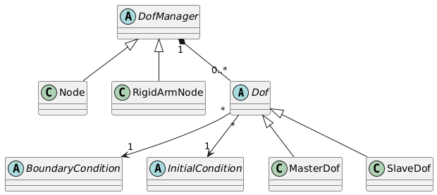

DofManagers, DOFs, Boundary and Initial conditions
=========================================================
..
  startuml
  abstract class Dof
  abstract class BoundaryCondition
  abstract class InitialCondition

  together {
  abstract class DofManager
  class Node
  class RigidArmNode
  }

  class MasterDof
  class SlaveDof

  DofManager "1" *-- "0..*" Dof
  Dof "*" --> "1" BoundaryCondition
  Dof "*" --> "1" InitialCondition

  DofManager <|-- Node
  DofManager <|-- RigidArmNode
  Dof <|-- MasterDof
  Dof <|-- SlaveDof
  @enduml

  // https://www.plantuml.com/plantuml/uml/RO_FYi8m48VlUOgGOo5bzxuizS_5Gpte4unDh84qWSbK4FNTRKmb67gR-Nx3p3TD840Q1ylW50YX8zvP285l_Rb4Qpyw1NZRUASC6U_AWPsRCDYSC_Azfej6Vb_OtuA3NYDBOE-Ldik3wOrQuV16JyPct48WZL4izKSBLnrRbfTnyIju9IKNFtLTYNWcfbnCjPJ_CLxuevme7_cwyFUGCjcMC7kdCD6i_K7PlD5EZODz0G00

Degrees of Freedom
-------------------
Abstract class `Dof` is provided and it represents abstraction for Degree Of Freedom (DOF) in finite element mesh. 
DOFs are possessed by DofManagers (i.e, nodes, element sides or whatever) and 
one `Dof` instance  can belong to only one `DofManager` instance.
`Dof` maintain its physical meaning and reference to
related DofManager (reference to DofManager which possess particular DOF).
To describe physical meaning of particular Dof, special enum type `DofId` has
been introduced (see src/core/cltypes.h). This type is more descriptive than 
UnknownType, which determines physical meaning for unknowns generally 
(displacement or temperature). `DofId` type has to distinguish between 
DOFs representing displacement, but in different directions, since
only some of those may be required by particular elements.

DOF can be subjected to boundary (BC) or initial (IC) condition. Method for 
obtaining DOF unknown value is provided. If no IC condition 
has been given, zero value IC is assumed otherwise when needed.

`Dof` class generally supports changes of static system during computation.
This feature generally leads to equation renumbering. Then because equation number
associated to dof may change, it may become extremely complicated to ask EngngModel
for unknown from previous time step (because equation number may have been changed).
To overcome this problem, derived class will implement so called unknown dictionary,
which is updated after finishing each time step and where unknowns for particular
dof are stored. Dof then uses this dictionary for requests for unknowns instead of 
asking EngngModel instance for unknowns. Unknowns in dof dictionary are updated by EngngModel
automatically (if EngngModel supports changes of static system) after finishing time
step. 

The base class `Dof` declares many services necessary for DOF
handling. Some of them are abstract, they have to be implemented by
derived classes representing specific DOF types.
This basic DOF interface includes the following services

- Services for requesting corresponding unknowns (`giveUnknown`)
  and the prescribed boundary values (`giveBcValue`).
- Methods for requesting associated equation number
  (`giveEquationNumber`).
- Services for requesting DOF properties (`hasBc`,
  `hasIc`, `giveDofID`, `giveDofIDName`,
  `giveUnknownType`, `isPrimaryDof`).
- Services for dof output (`printOutputAt`, `printStaticOutputAt`,
  `printDynamicOutputAt`),
- updating the receiver after new equilibrium is reached
  (`updateYourself`, `updateUnknownsDictionary`),
- services for storing/restoring context (`saveContext`, `restoreContext`).

The derived classes implement specific types of DOFs. The
most common types are provided with OOFEMlim. Supported are so-called
MasterDofs, representing true DOFs with their own equation number,
SlaveDOFs, representing single DOF linked to another single DOF, Rigid Arm DOFs
allowing to model rigid arms (single dof linked to one or more other DOFs).
Their brief description follows:

- `MasterDof` - class representing "master" degree of freedom. 
  Master is degree of freedom, which has its related unknown and
  corresponding equation number. It maintain its equation number.
- `SlaveDof` - class representing "slave" degree of freedom. 
  SlaveDOF is linked to some master dof (link slave-slave is not
  allowed). Slaves can be used to implement duplicated joints (by
  specifying some DOF in node as masters and some as slaves linked to
  DOFs in other node (with same or possibly different
  coordinates). SlaveDOF share the same equation number with
  master. Almost all operation as request for BC or IC or equation
  number are simply forwarded to master. Other functions (which change
  internal state) like updateYourself, updateUnknownsDictionary,
  askNewEquationNumber or context storing/restoring functions are empty
  functions, relying on fact that same function will be called also for
  master. From this point of view, one can see slave dof as link to
  other dof.
- `RigidArmSlaveDof` - class representing "rigid arm slave" degree
  of freedom. This DOF is linked to some master DOFs by linear
  combination (link slave-slave is
  not allowed) using rigid arm. Implemented using nodal
  transformation. The Rigid Arm Slave dof represent DOF, which is
  directly related to one or more master DOFs. Therefore the rigid arm slave's
  equation number is undefined. Similarly, rigid arm slave cannot have
  own boundary or initial conditions - these are entirely determined
  using master boundary or initial conditions.
  The transformation for DOFs and load is not orthogonal - the inverse
  transformation can not be constructed by transposition. Because of
  time consuming inversion, methods can generally compute both
  transformations for DOFs as well as load components. It is important to ensure
  (on input) that both slave dofManager and master dofManager are using
  the same local coordinate system. In future releases, this can be
  checked using checkConsistency function, where this check could be
  performed. 

Dof Managers
-------------------
The `DofManager` class is the base class for all DOF
managers. `DofManager` is an abstraction for object possessing degrees
of freedom (DOFs). Dof managers (respectively derived classes,
representing nodes or sides) are usually shared by several elements
and are maintained by corresponding domain. The elements keep the
logical reference to corresponding dof managers (they store their
numbers, not the physical links). 
The base class declares the variable storing total number of DOFs, 
the `dofArray`array representing the list of DOFs managed by dof
manager, and `loadArray` list for storing the applied
loadings references.
The `DofManager` declares (and implements some of them)
following services:

- DOF management methods. The methods for requesting the total number of
  DOFs (`giveNumberOfDofs`), requesting particular DOFs
  (`giveDof`), assembling location array of code numbers
  (`giveLocationArray` and `giveCompleteLocationArray`),
- methods for DOF selection based on their physical meaning
  (`giveDofArray` and `findDofWithDofId`), and services
  for requesting unknowns related to dof manager DOFs
  (`giveUnknownVector` and `givePrescribedUnknownVector`).
- Transformation functions. 
  The governing equations can be assembled not only in global coordinate system, but
  also in user-defined local coordinate system of each dof
  manager. Following methods introduce necessary transformation methods, 
  allowing DOFs to be expressed in their own local c.s. or to be
  dependent on other DOFs on other dofManager (to implement 
  slave or rigid arm nodes etc.). 
  The methods for computing transformation matrices from global c.s to
  receiver's defined coordinate system are declared
  (`computeDofTransformation` and `computeLoadTransformation`).
  The `requiresTransformation` indicates whether dofManager requires the transformation from global c.s. to 
  dof manager specific coordinate system.	
- Load/boundary condition management functions. The two methods are provided for handling
  applied loading - the service for computing the load vector of
  receiver in given time (`computeLoadVectorAt`) and service 
  providing the list of applied loads (`giveLoadArray`).
- Context related services for storing/restoring the receiver state to
  context (`saveContext` and `restoreContext` services)
  are implemented.
- Instantiating service `initializeFrom`.
- Miscellaneous services for receiver printing, identification, etc.

In the OOFEM core module, the common specialized dof managers are
defined and implemented. Those currently provided are:

- `Node` class. Class implementing node in finite element mesh. 
  Node manages its position in space, and if specified, its	
  local coordinate system in node. If local coordinate system is defined, all 
  equilibrium equations are assembled in this system and therefore all DOFs and
  applied  boundary and initial conditions apply in this local coordinate system.
  By default, global coordinate system is assumed in each node.
- `RigidArmNode` class.	
  Class implementing node connected to other node (master) using rigid arm in finite element mesh. 
  Rigid arm node supports not only slave DOFs mapped to master
  but also some DOFs can be primary DOFs. The `masterDofMask`
  attribute is introduced allowing to
  distinguish between primary and mapped (slave) DOFs. 
  The primary DOFs can have their own boundary and initial conditions.
  The introduction of rigid arm connected nodes allows to avoid very stiff elements used
  for modelling the rigid-arm connection. The rigid arm node maps its DOFs to master DOFs
  using simple transformations (small rotations are assumed). Therefore, the contribution
  to rigid arm node are localized directly to master related equations.
  The rigid arm node slave (mapped DOFs can not have its own boundary or initial conditions,
  they are determined completely from master dof conditions. 
  The local coordinate system in slave is not supported in current implementation, the global lcs applies.
  On the other hand, rigid arm node can be loaded independently of master.
  The transformation for DOFs and load is not orthogonal - the inverse transformation can 
  not be constructed by transposition. Because of time consuming inversion, methods 
  can generally compute both transformations for DOFs as well as loads.
- `ElementSide` class - representing finite element side possessing some DOFs.

Boundary Conditions
-------------------
The library introduces the base abstract class `GeneralBoundaryCondition` for all boundary
conditions (both primary and secondary). 
Boundary condition is an attribute of the domain (it belongs to).
The other system components subjected to boundary conditions keep reference to corresponding boundary
conditions, like elements, nodes, and DOFs.
	
The base class only declares itself as a base class of all boundary
conditions, and declares only very basic services. It introduces 
'loadTimeFunction' as an attribute of each boundary condition. 
'loadTimeFunction' represent time variation, its value is dependent on time step.
The value (or the components) of a boundary condition (load) will be 
the product of its value by the value of the associated load time function at given time step.
The meaning of boundary condition components is dependent on particular boundary condition type,
and should be defined in derived classes documentation. This base
class introduces also two general services for requesting  boundary
condition physical meaning and boundary condition geometrical
character (point-wise, acting on element body or edge and so on).

Derived classes should represent the base classes for particular boundary condition type (like
force load, or boundary condition prescribed directly on some DOF) and should declare
the basic common interface. For example, the `Load` is derived
from `GeneralBoundaryCondition` and represent base class for all
boundary conditions representing load. The following derived classes are provided by OOFEM core:

- `Load` class - base abstract class for all loads. Declares the
  attribute `componentArray` to store load components and
  method for evaluating the component values array at given time (component array multiplied
  with load time function value) is provided.
- `NodalLoad` - implementation of a concentrated load/flux (force,
  moment,...) that acts directly on a dof manager (node or element
  side, if it has associated DOFs). 
  This load could not be applied on an element. A nodal load is usually attribute of
  one or more nodes or element sides.
- `BoundaryLoad` - abstract base class representing a boundary
  load (force, momentum, ...) that acts directly on a boundary of some
  finite element (on element side, face, ...). Boundary load is usually
  attribute of one or more finite elements. This base class only
  declares the common services to all derived classes. Derived
  classes must implement abstract services and possibly may customize
  existing. Boundary load is represented by its geometry (determined by
  its type - linear, quadratic load) and values (it is assumed, that
  user will supply all necessary values for each dof).
  The load can generally be specified in global space or can be related
  to local entity space (related to edge, surface). If load is specified
  in global space then its values are evaluated at points, which is
  characterized by global coordinates. If load is specified in entity
  space, then point is characterized by entity isoparametric
  coordinates.
- `BodyLoad` - Class representing base class for all element body load, acting over
  whole element volume (e.g., the dead weight). 
- `BoundaryCondition` - class representing Dirichlet boundary condition (primary boundary condition). 
  This boundary condition is usually attribute of one or more degrees of
  freedom (DOF). The type of unknown (physical meaning) is fully
  determined by corresponding DOF, to which given BC is associated. 
  Boundary condition can change its value in time using its inherited
  `loadTimeFunction` attribute.
  It can also switch itself on or off depending on nonzero value of introduced
  isImposedTimeFunction load time function. Please note, that previous option must be
  supported by particular engineering model (because equation renumbering is necessary,
  and for incremental solution schemes DOFs unknown dictionaries must be used). See particular
  engineering model documentation for details.

Initial Conditions
-------------------
The `InitialCondition` - class implementing general initial condition. Initial condition is usually attribute of
one or more degrees of freedom (DOFs). One particular DOF (with its
physical meaning - for example displacement) can have associated only
single initial condition.	Initial condition thus must represent
several initial conditions for particular DOF (for example velocity
and acceleration of unknown can be prescribed using single initial
condition instance). These multiple entries are distinguished by their
`CharTypeMode`` value.	The CharTypeMode value is also used as key in
`initialValueDictionary`.
Initial conditions apply and should be taken into account	only in one
particular time step, which number is determined from engineering
model `giveNumberOfTimeStepWhenIcApply`` service. If in this
time step both boundary condition on unknown and also initial
condition on value of this unknown (TotalMode CharTypeMode) are
prescribed, then always value reported by boundary condition is taken
into account.
