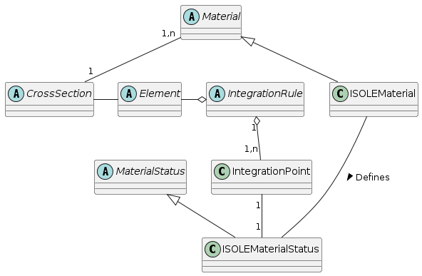
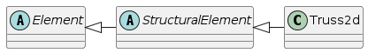

Elements
======================

In this frame, the following base classes are introduced:

- Class `Element`, which is an abstraction of a finite element. It declares
  common general services, provided by all elements. Derived
  classes are the base classes for specific analysis types (structural
  analysis, thermal analysis).  They declare and implement necessary services for
  specific analysis.
- Class `IntegrationPoint` is an abstraction for
  the integration
  point of the finite element. For historical reasons the `IntegrationPoint` is an alias to `GaussPoint` class. It maintains its coordinates and integration
  weight. Any integration point can generally contain any number of
  other integration points - called slaves. The `IntegrationPoint` instance containing slaves is called master. Slaves are, for example,
  introduced by a layered cross section model, where they represent
  integration points for each layer, or can be introduced at material
  model level, where they may represent, for example, micro-planes. Slave
  integration points are hidden from elements. The `IntegrationPoint`
  contains associated material status to store state variables (the reasons for introducing
  this feature will be explained later).
- `CrossSection` class is an abstraction for cross section. Its
  main role is to hide from an element all details concerning the cross
  section description and implementation. By cross section description
  is meant, for example, an integral cross section model, layered cross
  section model or fibered model. Elements do not communicate directly
  with material, instead they always use a `CrossSection`, which
  performs all necessary integration over its volume and invokes
  necessary material class services. Note, that for some problems, the use
  of cross section is not necessary, and then
  the elements can communicate directly with material model. However, for
  some problems (for example structural analysis) the introduction of cross section 
  is natural. 
- `Material` class is the base class for all
  constitutive models. Derived classes should be the base
  analysis-specific classes, which declare required analysis
  specific services (for example structural material class declares
  services for the stiffness computation and services for the real stress
  evaluation). Similarly to cross section representation, the material model analysis specific interface, defined
  in terms of general services, allows the use of any material model, even
  that added in the future, without modifying any code, because all material
  models implement the same interface.

One of the most important goals of OOFEM is its
extensibility. In the case of extension of the material library, the
analyst is facing a key problem. Every material model must store
its unique state variables in every integration point. The
amount, type, and meaning of these history variables vary for each
material model. Therefore, it is not possible to efficiently
match all needs and to reflect them in the integration point data
structure. The suggested remedy is the following:

The `IntegrationPoint` class is equipped with the possibility to have
associated a `MaterialStatus` class instance. When a new material model is
implemented, the analyst has also to declare and implement a related
material status derived from the base
`MaterialStatus` class. This status contains all necessary
state variables and related data access and modification
services. The `IntegrationPoint` provides services for inserting and
accessing its related status. For every `IntegrationPoint`,
the corresponding material creates unique copy of its material
status and associates it with that integration point. Because
the `IntegrationPoint` is a compulsory parameter of all `Material` class methods, the state variables are always accessible.

..
    @startuml
    together {
    abstract class  CrossSection
    abstract class  Element
    abstract class  IntegrationRule
    }

    abstract class Material
    abstract class MaterialStatus

    class ISOLEMaterial
    class ISOLEMaterialStatus
    class IntegrationPoint

    IntegrationRule "1" o-- "1,n" IntegrationPoint

    Material "1,n" -- "1" CrossSection
    Material <|-- ISOLEMaterial 
    ISOLEMaterial ---  ISOLEMaterialStatus: Defines >
    MaterialStatus <|-- ISOLEMaterialStatus
    CrossSection - Element
    Element -o IntegrationRule

    IntegrationPoint "1" - "1" ISOLEMaterialStatus

    @enduml

OOFEM Top level structure

In Fig (fig-elementmaterialframe_), the material - element frame is
depicted in more detail, although still simplified.

`Element` class
---------------
This class is the base class for all FE elements. It is also the
abstract class, declaring some services, which have to be implemented
by the derived classes. The main purpose of this class is to define a common interface and attributes, provided by all individual element implementations.
The `Element`` class does neither declare nor
implement any method related to specific analysis. These services are to be declared
and possibly implemented by derived classes.
The direct child of `Element` class are assumed to be the base
classes for particular analysis or problem type. They typically
introduce the general services required for a specific analysis purpose
- like evaluation of stiffness or mass matrices for structural
analysis, or evaluation of capacity and conductivity matrices for heat
transfer analysis. Usually they also provide generic implementation of
these services.

The `Element` class is derived from parent `FEMComponent`, leke many other classes. It inherits
the `FEMComponent` ability to keep its number and reference
to the domain, it belongs to, its error and warning
reporting services.
Also the `FEMComponent` class introduces several abstract services. The most
important are 

- `initializeFrom` for object initialization from a given record,
- `saveContext` and `restoreContext` methods for storing and restoring object state to/from a stream

The attributes defined by the `Element` class include the 
arrays used to keep its list of nodes and sides, variables to store its material
and cross section number, lists of applied body and boundary loads,
list of integration rules and array storing its code numbers.

The following important services are declared/introduced by the `Element`:

- services for component management - include services for
  accesing element's nodes, material and cross section  (`giveDofManager`, `giveNode`,
  `giveNumberOfDofManagers`, `giveNumberOfNodes`, `giveMaterial`, `giveCrossSection`).
- services related to code numbers management: 
  
  - `giveLocationArray` returns the element location array. This
    location array is obtained by appending  code-numbers of element
    nodes (according to the node numbering), followed by code numbers of
    element sides. The ordering of DOFs for the particular node/side is
    specified using a node/side DOF mask, which is obtained/defined by
    `giveNodeDofIDMask` or `giveSideDofIDMask` services.
    Please note, that this local DOF ordering must be taken into account when assembling various local characteristic 
    vectors and matrices. Once the element location array is assembled,
    it is cached and reused to avoid time consuming assembly. 
    Some engineering models
    may support dynamic changes of the static system (generally, of boundary conditions) during analysis,
    then these models use `invalidateLocationArray` function to invalidate location array
    after finishing time step, to force new equation numbering.
  - `computeNumberOfDofs` - computes or simply returns total
    number of element's local DOFs. Must be implemented by particular
    element. 
  - `giveDofManDofIDMask` service return
    DOF mask for corresponding dof manager (node or side). This mask defines the DOFs which are used by element 
    at the given node/side. The mask influences the code number ordering
    for the particular node. Code numbers are 
    ordered according to the node order and DOFs belonging to the particular node are ordered 
    according to this mask. If element requests DOFs using a node mask
    which are not in the node
    then error is generated. This masking allows node to be shared by different elements with 
    different DOFs in the same node/side. Element's local code numbers are
    extracted from the node/side using 
    this mask. These services must be implemented (overloaded) by
    particular element implementations.
- services for requesting the so-called  characteristic
  components: `giveCharacteristicMatrix` and `giveCharacteristicVector`. 
  The component requested is identified by parameter of type
  `CharType` (see cltypes.h). These are general methods for obtaining various element
  contributions to the global problem. These member functions have to
  be overloaded by derived analysis-specific 
  classes in order to invoke the proper method according to the type of
  requested component.
- services related to the solution step update and termination.
  These services are used to update the internal variables at
  element's integration points prior to reached state
  `updateYourself` and `updateInternalState`.
  Similar service for the internal state initialization is also declared
  (`initializeYourself`) and re-initialization to previous
  equilibrium state (see `initForNewStep`).
- services for accessing local element's unknowns from corresponding DOFs.
  These include methods for requesting local element vector of unknowns
  (`computeVectorOf`) and local element vector of prescribed
  unknowns (`computeVectorOfPrescribed`).
- Services for handling transformations between element local coordinate
  system and coordinate system used in nodes (possibly different from
  global coordinate system).  
- Othetr miscellaneous services. Their detailed description can be found in `Element` class definition in `src/core/element.h`.

Analysis specific element classes
---------------------------------
The direct child classes of the `Element` class are supposed to be (but not need to be) base
classes for particular problem types. For example, the
`StructuralElement` class is the base class for all structural
elements. It declares all necessary services required by structural
analysis (for example methods computing stiffness  matrices, load,
strain and stress vectors etc.). This class may provide general
implementations of some of these services if possible, implemented
using some low-level virtual functions (like computing element shape functions), which are declared, but
their implementation is left on derived classes, which implement specific
elements.

Structural element
------------------

To proceed, lets take  `StructuralElement` class as an example. This class is derived from the `Element` class.
The basic tasks of the structural element is to compute its contributions
to global equilibrium equations (mass and stiffness matrices, various
load vectors (due to boundary conditions, force loading, thermal
loading, etc.) and computing the corresponding strains and stresses
from nodal displacements. Therefore the corresponding virtual services
for computing these contributions are declared.
These standard contributions can be computed by numerical
integration  of appropriate terms, which typically depend on 
element interpolation or material model, over the element volume. Therefore, it is possible to
provide general implementations of these services, provided that the
corresponding methods for computing interpolation dependent terms and
material terms are implemented, and corresponding integration rules
are initialized. 

This concept will be demonstrated on service computing stiffness
matrix. Since element stiffness matrix contributes to the global
equilibrium, the stiffness will be requested (by engineering model) using
`giveCharacteristicMatrix` service. 

.. code-block:: cpp
   :linenos:

    void
    StructuralElement ::  giveCharacteristicMatrix (FloatMatrix& answer, 
                        CharType mtrx, TimeStep *tStep) 
    // 
    // returns characteristic matrix of receiver according to mtrx
    //
    {
    if (mtrx == TangentStiffnessMatrix) 
        this -> computeStiffnessMatrix(answer, TangentStiffness, tStep);
    else if (mtrx == SecantStiffnessMatrix) 
        this -> computeStiffnessMatrix(answer, SecantStiffness, tStep);
    else if (mtrx == MassMatrix) 
        this -> computeMassMatrix(answer, tStep);
    else if 
    ....
    }

The first parameter is the matrix to be computed, the mtrx
parameter determines the type of contribution and the last parameter, time step, represents solution step.
Focusing only on material nonlinearity, the element stiffness matrix can be evaluated using well-known formula

.. math::
    {K} = \int_{V} {B}^T{D}{B}\;dV,

where B is the so-called geometrical matrix, containing
derivatives of shape functions and D is the material stiffness
matrix. If D is symmetric (which is usually the case) then
element stiffness is symmetric, too. The numerical integration is used to evaluate the integral.
For numerical integration, we will use `IntegrationRule` class instance.
The integration rules for a specific element are created during element
initialization and are stored in `integrationRulesArray` attribute,
defined/introduced by the parent `Element` class. In order to implement the stiffness
evaluation, the methods for computing geometrical matrix B and material stiffness
matrix D are declared (as virtual), but not implemented. They have to
be implemented by specific elements, because they know their interpolation
and material mode details. 
The implementation of `computeStiffnessMatrix`` is as follows:

.. code-block:: cpp
   :linenos:

    void
    StructuralElement :: computeStiffnessMatrix (FloatMatrix& answer, 
                        MatResponseMode rMode, TimeStep* tStep)
    // Computes numerically the stiffness matrix of the receiver.
    {
    int j;
    double      dV ;
    FloatMatrix d, bj, dbj;
    GaussPoint  *gp ;
    IntegrationRule* iRule;

    // give reference to integration rule
    iRule = integrationRulesArray[giveDefaultIntegrationRule()];
        
    // loop over integration points
    for (j=0 ; j < iRule->getNumberOfIntegrationPoints() ; j++) {
        gp = iRule->getIntegrationPoint(j) ;
        // compute geometrical matrix of particular element 
        this -> computeBmatrixAt(gp, bj) ;  
        //compute material stiffness
        this -> computeConstitutiveMatrixAt(d, rMode, gp, tStep); 
        // compute jacobian
        dV = this -> computeVolumeAround(gp) ; 
        // evaluate stiffness
        dbj.beProductOf (d, bj) ;
        answer.plusProductSymmUpper(bj,dbj,dV) ; 
    }
    answer.symmetrized() ;
    return  ;
    }

Inside the integration loop, only the upper half of the element stiffness is
computed in element local coordinate system. Then, the lower part of 
the stiffness is initialized from the upper part (answer.symmetrized()). 
The other element contributions can be computed using similar
procedures. In general, different integration rules can be used for
evaluation of different element contributions. For example, the
support for the reduced
integration of some terms of the stiffness matrix can be easily supported.

The element strain and stress vectors are to be
computed using `computeStrainVector` and
`computeStressVector` services. The element strain vector can
be evaluated using 

.. math::
    \varepsilon={B}{u},

where B is the geometrical matrix and u is element local displacement
vector.

.. code-block:: cpp
   :linenos:

    void
    StructuralElement :: computeStrainVector (FloatArray& answer, 
                        GaussPoint* gp, TimeStep* stepN)
    // Computes the vector containing the strains 
    // at the Gauss point gp of the receiver, 
    // at time step stepN. The nature of these strains depends
    // on the element's type.
    {
    FloatMatrix b;
    FloatArray  u ;
    
    this -> computeBmatrixAt(gp, b) ;
    // compute vector of element's unknowns
    this -> computeVectorOf(DisplacementVector,
                            UnknownMode_Total,stepN,u) ;
    // transform global unknowns into element local c.s.
    if (this->updateRotationMatrix()) 
        u.rotatedWith(this->rotationMatrix,'n') ;
    answer.beProductOf (b, u) ;
    return ;
    }

The stress evaluation on the element level is rather simple, since the stress
evaluation from a given strain increment and actual state (kept within
the integration point) is done at the cross section and material model levels:

.. code-block:: cpp
   :linenos:
    
    void
    StructuralElement :: computeStressVector (FloatArray& answer, 
                        GaussPoint* gp, TimeStep* stepN)
    // Computes the vector containing the stresses 
    // at the Gauss point gp of the receiver, at time step stepN. 
    // The nature of these stresses depends on the element's type.
    {
    FloatArray Epsilon ;
    StructuralCrossSection* cs = (StructuralCrossSection*) 
                                this->giveCrossSection();
    Material *mat = this->giveMaterial();
    
    this->computeStrainVector (Epsilon, gp,stepN) ;
    // ask cross section model for real stresses 
    // for given strain increment 
    cs -> giveRealStresses (answer, ReducedForm, gp, Epsilon, stepN);
    return  ;
    }

For further reference see src/sm/Elements/structuralelement.h
and src/sm/Elements/structuralelement.C files located in your source oofem directory.

Example: 2D Truss element
--------------------------
In this section, we provide a simple, but complete example of a two-dimensional truss element implementation. 
The element is derived from the `StructuralElement` class and is called `Truss2d`:

.. 
    @startuml
    Abstract class Element
    Abstract class StructuralElement
    class Truss2d

    Element <|- StructuralElement
    StructuralElement <|- Truss2d

    @enduml

The definition of the `Truss2d` class is as follows (see also sm/src/Elements/Bars/Truss2d.h):

.. code-block:: cpp
   :linenos:
 
    class Truss2d : public StructuralElement {
    protected :
        double        length ;
        double        pitch ;
    public :
        Truss2d (int,Domain*) ;    // constructor
        ~Truss2d ()   {}           // empty destructor
        // mass matrix coputations
        void computeLumpedMassMatrix (FloatMatrix& answer, 
                                     TimeStep* tStep) override;
        // general mass service overloaded 
        void computeMassMatrix (FloatMatrix& answer, TimeStep* tStep) override 
            {computeLumpedMassMatrix(answer, tStep);}
        // DOF management
        virtual int            computeNumberOfDofs (EquationID ut) override {return 4;}
        virtual void           giveDofManDofIDMask  (int inode, EquationID, IntArray& ) const override;

        double computeVolumeAround (GaussPoint*) override;
        // definition & identification
        char* giveClassName (char* s) const override
             { return strcpy(s,"Truss2d") ;}
        classType giveClassID () const override { return Truss2dClass; } 

        IRResultType initializeFrom (InputRecord* ir) override;
    protected:
        // computes geometrical matrix 
        void computeBmatrixAt (GaussPoint*, FloatMatrix&, 
                                int=1, int=ALL_STRAINS) override;
        // computes interpolation matrix
        void computeNmatrixAt (GaussPoint*, FloatMatrix&) override;
        // initialize element's integration rules
        void computeGaussPoints () override;
        // transformation from global->local c.s.
        int           computeGtoLRotationMatrix (FloatMatrix&) override;

        double giveLength () ;
        double givePitch () ;
    } ;

The `Truss2d` class declares two attributes, the element `length`` and element `pitch`, defined as angle between global x-axis and element x-axis. They can be computed from coordinates of element nodes, but they are used at different places of implementation and precomputing then can save some proccesing time.
We define the constructor and destructor of the `Truss2d` class. Next we define methods to compute characteristic contributions of the element. 
Note that default implementation of characteristic matrix evaluation (stiffness nad mass matrix) is already provided by parent `StructuralElement` class.
We just need to implement the methods for computing geometrical and interpolation matrices.
However in this case, the mass matrix is going to be computed using the lumped mass matrix method, and we need to overload the default implementation.

We also need to implement the methods for computing the number of element DOFs (`computeNumberOfDofs`), method to return element DOFs for specific node (`giveDofManDofIDMask`). 
Also, the method to evaluate the volume associated to given integration point (`computeVolumeAround`), method to initialize element from input record (`initializeFrom`).
Finally, in the protected section, there is a declaration of methods for computing the geometrical ( `computeBmatrixAt`) and interpolation matrices (`computeNmatrixAt`), 
as well as the method to initialize the element's integration rules (`computeGaussPoints`) and method to compute the element transformation matrix (`computeGtoLRotationMatrix`).
Note than all these methods overload/specialize/define methods declared in the parent `StructuralElement` or `Element` classes.
Finally, we declare two methods to compute the element length and pitch.

The implementation of the `Truss2d` class is as follows (see also sm/src/Elements/Bars/Truss2d.C, but note this implementation supports geometrical nonlinearity and is more general), wih some minor methods ommited for brevity:
We start with the services for computing interpolation and geometrical matrices.
Note that the implementation of the \service{computeNmatrixAt} is not necessary
for the current purpose (it would be required by the default mass matrix computation), but it is added for completeness.
The both methods compute response at a given integration point, which is
passed as a parameter. The \service{computeBmatrixAt} has two additional
parameters which determine the range of strain components for which
response is assembled. This has something to do with support for
reduced/selective integration and is not important in presented case.

The ordering of element unknowns is following: :math:`r_e=\{u1,y1, u2,y2\}^T`, where u1,u2 are displacements in x-direction and y1,y2 are displacements in y-direction and indices indicate element nodes. 
This ordering is defined by element node numbering and element nodal unknowns (determined by `giveDofManDofIDMask` method). The vector of unknowns (and also element code numbers) is appended from nodal contributions.
The element uses linear interpolation functions, so the element shape functions are linear functions of the local coordinate. The element has 2 nodes, so the element has 4 DOFs.
The interpolation functions are defined as follows:

.. math::
    N_1 = \frac{1-\xi}{2}, \quad N_2 = \frac{1+\xi}{2},

and their derivatives:

.. math::
    \frac{\partial N_1}{\partial \xi} = -\frac{1}{2}, \quad \frac{\partial N_2}{\partial \xi} = \frac{1}{2}.

So that the interpolation and geometrical matrices are defined as follows:

.. math::
    \{u,v\}^T = N^e r_e, \ \{\varepsilon\} = B^e r_e^l\\[4mm]
    B^e = \begin{bmatrix} -\frac{1}{L} & 0 & \frac{1}{L} & 0 \end{bmatrix},\\
    \quad N^e = \begin{bmatrix} N_1 & 0 & N_2 & 0 \\ 0 & N_1 & 0 & N_2 \end{bmatrix},

The transformation matrix from unknowns in global coordinate system to element local coordinate system is defined as follows:

.. math::
    \cos\theta = (x_2-x_1)/l,\ \sin\theta = (y_2-y_1)/l,\\[4mm]
    \begin{bmatrix} u_1 \\ v_1 \\ u_2 \\ v_2 \end{bmatrix}^l = \begin{bmatrix} \cos \theta & \sin \theta & 0 & 0 \\ -\sin \theta & \cos \theta & 0 & 0 \\ 0 & 0 & \cos \theta & \sin \theta \\ 0 & 0 & -\sin \theta & \cos \theta \end{bmatrix} \begin{bmatrix} u_1 \\ v_1 \\ u_2 \\ v_2 \end{bmatrix}^g,

where :math:`\theta` is the pitch of the element.

.. note:: Recently, the interpolation classes have been added, that can significantly facilitate the element implementation. They provide shape functions, their derivatives, and transformation Jacobian out of the box. 
 
..

.. code-block:: cpp
   :linenos:

    void
    Truss2d ::   giveDofManDofIDMask  (int inode, EquationID, IntArray& answer) const {
    // returns DofId mask array for inode element node.
    // DofId mask array determines the dof ordering requested from node.
    // DofId mask array contains the DofID constants (defined in cltypes.h)
    // describing physical meaning of particular DOFs.
    //IntArray* answer = new IntArray (2);
    answer.resize (2);

    answer.at(1) = D_u;
    answer.at(2) = D_w;

    return ;
    }

    void
    Truss2d :: computeNmatrixAt (GaussPoint* aGaussPoint, 
                                FloatMatrix& answer) 
    // Returns the displacement interpolation matrix {N} 
    // of the receiver, evaluated at aGaussPoint.
    {
        double       ksi,n1,n2 ;

        ksi = aGaussPoint -> giveCoordinate(1) ;
        n1  = (1. - ksi) * 0.5 ;
        n2  = (1. + ksi) * 0.5 ;

        answer.resize (2,4);
        answer.zero();

        answer.at(1,1) = n1 ;
        answer.at(1,3) = n2 ;
        answer.at(2,2) = n1 ;
        answer.at(2,4) = n2 ;

        return  ;
    }

    void
    Truss2d :: computeBmatrixAt (GaussPoint* aGaussPoint, 
                                FloatMatrix& answer, int li, int ui)
    // 
    // Returns linear part of geometrical 
    // equations of the receiver at gp.
    // Returns the linear part of the B matrix
    //
    {
    double coeff,l;

    answer.resize(1,4);
    l = this->giveLength();
    coeff = 1.0/l;

    answer.at(1,1) =-coeff;
    answer.at(1,2) = 0.0;
    answer.at(1,3) = coeff;
    answer.at(1,4) = 0.0;

    return;
    
Next, the following two functions compute the basic geometric
characteristics of a bar element - its length and pitch, defined as the
angle between global x-axis and the local element x-axis (oriented
from node1 to node2).

.. code-block:: cpp
   :linenos:

    double  Truss2d :: giveLength ()
    // Returns the length of the receiver.
    {
        double dx,dz ;
        Node   *nodeA,*nodeB ;

        if (length == 0.) {
        nodeA = this->giveNode(1) ;
        nodeB = this->giveNode(2) ;
        dx    = nodeB->giveCoordinate(1)-nodeA->giveCoordinate(1);
        dz    = nodeB->giveCoordinate(3)-nodeA->giveCoordinate(3);
        length= sqrt(dx*dx + dz*dz) ;}

        return length ;
    }

    double  Truss2d :: givePitch ()
    // Returns the pitch of the receiver.
    {
        double xA,xB,zA,zB ;
        Node   *nodeA,*nodeB ;

        if (pitch == 10.) {  // 10. : dummy initialization value
        nodeA  = this -> giveNode(1) ;
        nodeB  = this -> giveNode(2) ;
        xA     = nodeA->giveCoordinate(1) ;
        xB     = nodeB->giveCoordinate(1) ;
        zA     = nodeA->giveCoordinate(3) ;
        zB     = nodeB->giveCoordinate(3) ;
        pitch  = atan2(zB-zA,xB-xA) ;}

        return pitch ;
    }

When an element is created, the default
constructor is called. To initialize the element, according to its
record in the input file, the `initializeFrom` is
immediately called after element creation. The element implementation
should first call the parent implementation to ensure that attributes
declared at parent level are initialized properly. 
Then the element has to
initialize attributes declared by itself and also to set up its
integration rules. In our example, special method
`computeGaussPoints` is called to
initialize integration rules.
in this case, only one integration rule is created. It is of type 
`GaussIntegrationRule`, indicating that the Gaussian  integration
is used. Once integration rule is created, its integration points are 
created to represent line integral, with 1 integration
point. Integration points will be associated to element under
consideration and will have 1D material mode (which determines the type of
material model response):

.. code-block:: cpp
   :linenos:

    IRResultType
    Truss2d :: initializeFrom (InputRecord* ir)
    {
        this->NLStructuralElement :: initializeFrom (ir);
        this -> computeGaussPoints();
        return IRRT_OK;
    }

    void  Truss2d :: computeGaussPoints ()
        // Sets up the array of Gauss Points of the receiver.
    {

    numberOfIntegrationRules = 1 ;
    integrationRulesArray = new IntegrationRule*;
    integrationRulesArray[0] = new GaussIntegrationRule (1,domain, 1, 2);
    integrationRulesArray[0]->
        setUpIntegrationPoints (_Line, 1, this, _1dMat);

    }

Next, we present method calculating lumped mass matrix:

.. code-block:: cpp
   :linenos:

    void
    Truss2d :: computeLumpedMassMatrix (FloatMatrix& answer, TimeStep* tStep)
        // Returns the lumped mass matrix of the receiver. This expression is
        // valid in both local and global axes.
    {
        Material* mat ;
        double    halfMass ;

        mat        = this -> giveMaterial() ;
        halfMass   = mat->give('d') * 
                    this->giveCrossSection()->give('A') * 
                    this->giveLength() / 2.;

        answer.resize (4,4) ; answer.zero();
        answer . at(1,1) = halfMass ;
        answer . at(2,2) = halfMass ;
        answer . at(3,3) = halfMass ;
        answer . at(4,4) = halfMass ;

        if (this->updateRotationMatrix()) 
        answer.rotatedWith(*this->rotationMatrix) ;
        return  ;
    }

Finally, the following method computes the part of the element transformation
matrix, corresponding to transformation between global  and element
local coordinate systems. This method is called from
the `updateRotationMatrix` service, implemented at
the `StructuralElement` level, which computes the element
transformation matrix, taking into account further transformations
(nodal coordinate system, for example). 

.. code-block:: cpp
   :linenos:

    int
    Truss2d ::  computeGtoLRotationMatrix (FloatMatrix& rotationMatrix) 
    // computes the rotation matrix of the receiver.
    // r(local) = T * r(global)
    {
    double sine,cosine ;

    sine           = sin (this->givePitch()) ;
    cosine         = cos (pitch) ;

    rotationMatrix.resize(4,4);
    rotationMatrix . at(1,1) =  cosine ;
    rotationMatrix . at(1,2) =  sine   ;
    rotationMatrix . at(2,1) = -sine   ;
    rotationMatrix . at(2,2) =  cosine ;
    rotationMatrix . at(3,3) =  cosine ;
    rotationMatrix . at(3,4) =  sine   ;
    rotationMatrix . at(4,3) = -sine   ;
    rotationMatrix . at(4,4) =  cosine ;

    return 1 ;
    }

 
