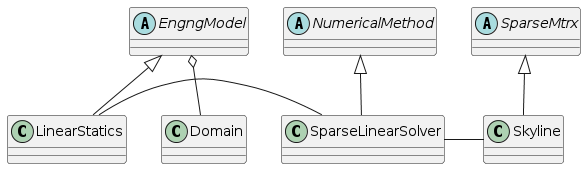
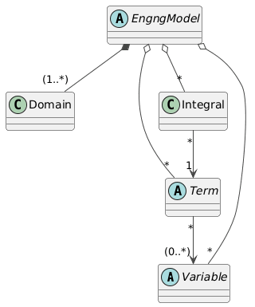

.. _ProblemFrame:

Problem representation (Engineering model)
~~~~~~~~~~~~~~~~~~~~~~~~~~~~~~~~~~~~~~~~~~~

In this section, we introduce in detail how the problems are represented, their discrete form assembled and finally solved.

We start with `EngngModel` class, which is an abstraction for the problem under
consideration. It represents the analysis to be performed.
Base class declares and implements the basic general services for assembling
characteristic components and services for starting the solution step and
its termination. Derived classes know the form of governing
equation and the physical meaning of  particular components. 
They are responsible for forming the governing equation for each solution
step,  usually by summing contributions from particular elements and
nodes, and their solution using the suitable numerical method.

..
    @startuml
    together {
    abstract class  "EngngModel"
    abstract class  "NumericalMethod"
    abstract class  "SparseMtrx"
    }

    together{
    class Domain
    class LinearStatics
    class SparseLinearSolver
    }
    class Skyline

    EngngModel o-- Domain
    EngngModel ^-- LinearStatics
    NumericalMethod ^-- SparseLinearSolver
    SparseMtrx ^-- Skyline
    LinearStatics - SparseLinearSolver
    SparseLinearSolver - Skyline
    @enduml

..
   //www.plantuml.com/plantuml/png/ROw_ZeCm3CPtFqN4pZimt6t7BUoLt63Hg4vIEQPgXNZtefAMKXZzy_VdgvAYQEyPD7Qa9n8p01wJ2berbZ4bOuhVq8MkZYrniNt-zvx4MUHwyiTsHz5SK1BLAhS2HdWt3J0BVg975_BnvmAXD8hgRCfizkTFv2i9ZA_N-SuJ1rWccbYMEVEJ7YQw3lyQ_bJiL2thPqLkN6MPNUSMcSKF5OMsz_m0

The solution step may represent either a time step, a load increment, or a load
case. The solution steps are grouped together into so called meta steps. 
The meta step can be thought as a sequence of
solution steps, with the same set of attributes used to drive the behavior of
EngngModel.
For each meta step, the `EngngModel` typically updates  
its control parameters according to ones defined by meta step (see
updateAttributes service) and generates the sequence of the solution steps. 
This allows to switch to a different time increment, 
a different solution control, etc. If no meta step is specified, the EngngModel
creates a default one for all solution steps. There are two
services, where EngngModel attributes are set or updated. The first one,
used for those attributes which do not vary during the solution 
of the problem, are initialized  in `instanciateYourself` service.
The `updateAttributes` method is called when specific meta step is activated, and selected attributes 
are updated from corresponding meta step attributes.
If no meta step is introduced, a default one is created 
(with the attributes set to the EngngModel attributes). 
Then there is no difference, whether the attributes are initialized 
in instanciateYourself or in updateAttributes, but
the preferred scheme is to read all attributes in instanciateYourself 
and to left updateAttributes service empty.

The basic `EngngModel` tasks are following:

- Assembling governing equations by summing contributions (typically from nodes and elements).
- Solving the problem described by governing equation(s) using the instance of a 
  suitable numerical method. This requires to establish a mapping between numerical method-parameters 
  and EngngModel components of governing equation.
  EngngModel must map each component of governing
  equation(s) (which has physical meaning) to the corresponding numerical component.
  This mapping between physical components to independent numerical components    
  (understood by the numerical method) is important, because it allows
  the numerical method to be used by
  many EngngModels with different component meaning and allows to use 
  different numerical methods by EngngModel. This is achieved by using
  the compulsory numerical component names (see further).
- Providing access to the problem solution. Services for returning unknown
  values according to their type and mode are provided. These services are used by DOFs to 
  access their corresponding unknowns.
- Terminating the time step by updating the state of the problem domains (nodes and
  elements, including integration points).
- Managing the problem domains, meta steps, and problem input/output streams.
- Equation numbering.
- Storing and restoring problem state to/from context file.
- Managing and updating unknowns 

The complete listing of `EngngModel` class declaration can be found here: https://github.com/oofem/oofem/blob/master/src/core/engngm.h. It is well commented and should be self-explanatory.

One of the key methods of `EngngModel` class is
`solveYourself`, which is invoked to starts the solution of the problem. 
The default implementation loops over individual metasteps. For each metastep, the loop over nested solution steps is
performed. The representation of solution step (`TimeStep` class instance) is created inside `giveNextStep` service and stored in EngngModel attribute `currentStep`.
After some initializations, the solution step is solved by calling `solveYourselfAt` service, which performs solution for specific solution step, passed as its parameter.

The simplified implementation of `solveYourself` service is shown below:

.. code-block:: cpp
   :linenos:

   void 
   EngngModel :: solveYourself ()
   {
        int imstep, jstep;
        int smstep=1, sjstep=1;
        MetaStep* activeMStep;

        for (imstep = smstep; imstep<= nMetaSteps; imstep++) {
            activeMStep = this->giveMetaStep(imstep);
            for (jstep = sjstep; jstep <= activeMStep->giveNumberOfSteps(); jstep++) {     
            this->giveNextStep();
            // update attributes according to new meta step attributes
            if (jstep == sjstep) this->updateAttributes (this->giveCurrentStep());
            this->solveYourselfAt(this->giveCurrentStep());
            this->updateYourself( this->giveCurrentStep() );
            this->terminate( this->giveCurrentStep() );

        }
   }

The `solveYourselfAt` method typically assembles characteristic matrices and vectors 
and solves the problem using the suitable numerical method. The implementation should be provided by derived classes implementing specific problem.
(see section \ref{Engngmodelexample} for an example).
After finishing the solution for the given solution step, `updateYourself` service is called to update the state of all components. Finally `terminate` service is called.

The default implementation of `updateYourself` service loops over all
problem domains and calls corresponding update service for all DOF
managers and elements:

.. code-block:: cpp
   :linenos:

    void
    EngngModel :: updateYourself(TimeStep *tStep)
    {
        for ( auto &domain: domainList ) {
            for ( auto &dman : domain->giveDofManagers() ) {
                dman->updateYourself(tStep);
            }
            for ( auto &elem : domain->giveElements() ) {
                 elem->updateYourself(tStep);
            }
    }

The `terminate`` service essentially prints the
required outputs and optionally saves the
context file (if required), so the solution can be restarted from this
saved state later:

.. code-block:: cpp
   :linenos:

    void
    EngngModel :: terminate(TimeStep *tStep)
    {
        exportModuleManager.doOutput(tStep);
        this->saveStepContext(tStep, CM_State | CM_Definition);
    }

Both services are virtual, so they can be easily
tailored to specific needs.

The `EngngModel` class comes with handy generic services for characteristic components assembly, that are used by derived classes to assemble the characteristic components of the problem.
They essentially loop over nodes or elements (depending on
the character of the requested component) of the given domain, requesting the
corresponding component (determined or even evaluated by assembler class instance) and corresponding code numbers. 
The component contributions are assembled (using code numbers) into
a target array or matrix. Here we show the simplified implementation of one of these services to assemble the characteristic matrix:

.. code-block:: cpp
   :linenos:

    void EngngModel :: assemble(SparseMtrx &answer, TimeStep *tStep, const MatrixAssembler &ma,
                                const UnknownNumberingScheme &s, Domain *domain)
    {
        IntArray loc;
        FloatMatrix mat, R;
        int nelem = domain->giveNumberOfElements();

        for ( int ielem = 1; ielem <= nelem; ielem++ ) {
            auto element = domain->giveElement(ielem);
            ma.matrixFromElement(mat, *element, tStep);

            if ( mat.isNotEmpty() ) {
                ma.locationFromElement(loc, *element, s);
                if ( element->giveRotationMatrix(R) ) {
                    mat.rotatedWith(R);
                }
                if ( answer.assemble(loc, mat) == 0 ) {
                    OOFEM_ERROR("sparse matrix assemble error");
                }
            }
        }
    }

The `assemble` service is used to assemble the characteristic matrix from elements contributions. 
The `MatrixAssembler` class instance is used to parametrize the `aasemble` method and it determines the element contributions. In the simple form, it can request characteristic matrix directly from element, 
but it can also evaluate the element contribution. 
The `UnknownNumberingScheme` class instance determines the unknown numbering and thus determines the code numbers of the unknowns. 
The `SparseMtrx` class instance is used to store the assembled matrix. 

Numerial Method Interface
-------------------------
The `EngngModel` needs to solve the underlying discrete problem. This is done by the suitable instance of `NumericalMethod` class.
The design attempts to separate the problem formulation from the numerical solution of the problem, and the data storage format.

Derived classes from `NumericalMethod` class are supposed to declare the interface for specific problem type (like solution of linear system). 
The interface usually consist in declaring virtual abstract function `solve`, with parameters corresponding to problem under consideration. 
The data are specified using parameters passed to `solve` method (so called mapping of physical components to their numerical counterpart). 
The parameters of numerical method either are passed to `solve` method or are set by `instanciateYourself` service from input file. 
The `solve` method shoud return value of `NM_Status` type.

Many problems require updating components during the solution. To keep definition and implementation of numerical method independent on particular problem, the `EngngModel` must also provide service for updating mapped components
components, if this is necessary. This is provided by `EngngModel::updateComponent` method. This method is invoked by numerical method, when the update of some components during solution is needed (for
example in the Newton Raphson algorithm for the solution of non-linear
equations, stiffness or internal force vector need to be updated during the solution process). 

The derived classes from \class{Numerical method} are supposed to
declare the interface for specific problem type
(like solution of linear system). It should be pointed out, that all numerical methods solving the same
numerical problem have to use the same genaral interface - this is
enforced by introducing the abstract class representing family of numerical method for solving specific problem and declaring the common interface.

There are typically multiple numerical methods for solving the same problem.
The `NumericalMethod` can implement the solution itself, but it can also implement an interface to external numerical libraries (like PETSc, Trilinos, etc.).

This concept is further enhanced by the introduction of a base abstract
class `SparseMatrix` representing sparse matrix storage. This class only declares the basic
required services provided by all sparse matrix implementations (like assembly of contribution, multiplication
by a vector, possible factorization, etc). The implementation is left on
derived classes.  Numerical methods are then implemented only
using basic services declared by the `Sparse Matrix` class. Thus, numerical
method class instances will work with any sparse matrix representation, even
added in the future, without changing any code.

As an example, the declaration of the `SparseLinearSystem` class is shown below. This class is an abstraction for all numerical methods solving sparse linear system of equations.

.. code-block:: cpp
   :linenos:

    class SparseLinearSystemNM : public NumericalMethod
    {
    public:
        /// Constructor.
        SparseLinearSystemNM(Domain * d, EngngModel * m);
        /// Destructor.
        virtual ~SparseLinearSystemNM();

        /**
        * Solves the given sparse linear system of equations @f$ A\cdot x=b @f$.
        * @param A Coefficient matrix.
        * @param b Right hand side.
        * @param x Solution array.
        * @return Status of the solver.
        */
        virtual ConvergedReason solve(SparseMtrx &A, FloatArray &b, FloatArray &x) = 0;

        /**
        * Solves the given sparse linear system of equations @f$ A\cdot X=B @f$.
        * Default implementation calls solve multiple times.
        * @param A Coefficient matrix.
        * @param B Right hand side.
        * @param X Solution matrix.
        * @return Status of the solver.
        */
        virtual ConvergedReason solve(SparseMtrx &A, FloatMatrix &B, FloatMatrix &X);
    };

To summarize, the natural independence of the problem formulation,
numerical solution of the problem, and data storage format have been
obtained, which leads to a modular and extensible structure.

Domain class
------------
The computational grid is represented by `Domain` class.
It manages all components of the FEM discrete model. These include dof managers
(nodes, element sides possessing DOFs), elements, material and cross
section models, boundary and initial conditions, time functions, and so on.
For every component type `Domain` maintains the
component list and provides the corresponding access services.

The basic services provided by Domain are the following:

- Reading its description from input and creating corresponding objects.
  This task includes the reading and parsing the particular mesh input
  records, creating the corresponding components representations
  (objects) of appropriate type, initializing these components using
  their `instanciteFromString` methods and storing them into
  corresponding list.
- Provides services for accessing its particular components. 
  The services returning the total number of particular domain
  components and particular component access methods based on component
  number are provided. 

The domain also manages instances of
`SpatialLocalizer` and `connectivityTable` classes
to serve the connectivity and  spatial localization related services
(finding elements shared by the node, finding the closest node search,
finding the element containing given point, etc.).

For complete definition of `Domain` class interface, 
please go to  https://github.com/oofem/oofem/blob/master/src/core/domain.h

Example - Linear Static Analysis implementation
-----------------------------------------------

In this section, the example of the implementation of linear static
analysis will be given. 
The linear static analysis is a typical example of a structural engineering problem.    
In this particular case, the analysis is time independent, meta steps are not used (default
one is created) and time steps are used to distinguish load cases (different load vectors). 

The class definition includes the declaration of characteristic
components of the problem - the stiffness matrix and load and
displacement vectors. Two additional variables are used to store the
linear solver type and the sparse matrix type, which can be selected by the user.
Finally, the reference to suitable instance of `SparseLinearSystemNM` class is stored in the `nMethod` attribute.

The following services are declared/implemented:
  - `solveYourselfAt` for solving the solution step, responsible for forming the stiffness matrix and load vector, and calling the numerical method to solve the problem, 
  - `giveUnknownComponent` providing access to problem unknowns (displacements), 
  - context i/o services for serializing and deserializing the state of the problem (`saveContext` and `restoreContext` services), 
  - solver parameter initialization (`initializeFrom`) and  consistency checking (`checkConsistency`).

.. code-block:: cpp
   :linenos:

    class LinearStatic : public StructuralEngngModel
    {
    protected:
        std :: unique_ptr< SparseMtrx > stiffnessMatrix;
        FloatArray loadVector;
        FloatArray displacementVector;

        LinSystSolverType solverType;
        SparseMtrxType sparseMtrxType;
        /// Numerical method used to solve the problem.
        std :: unique_ptr< SparseLinearSystemNM > nMethod;

        int initFlag;
        EModelDefaultEquationNumbering equationNumbering;

    public:
        LinearStatic(int i, EngngModel *master = nullptr);
        virtual ~LinearStatic();

        void solveYourself() override;
        void solveYourselfAt(TimeStep *tStep) override;

        double giveUnknownComponent(ValueModeType type, TimeStep *tStep, Domain *d, Dof *dof) override;
        void saveContext(DataStream &stream, ContextMode mode) override;
        void restoreContext(DataStream &stream, ContextMode mode) override;

        void updateDomainLinks() override;

        TimeStep *giveNextStep() override;
        NumericalMethod *giveNumericalMethod(MetaStep *mStep) override;

        void initializeFrom(InputRecord &ir) override;

        virtual UnknownNumberingScheme &giveEquationNumbering() { return equationNumbering; }

        // identification
        virtual const char *giveInputRecordName() const { return _IFT_LinearStatic_Name; }
        const char *giveClassName() const override { return "LinearStatic"; }
    };

The implementation of the \class{LinearStatic} class and its methods follows. 
First, we start with `initializeFrom` method, responsible for reading user input parameters. The input record is represented by instance of `InputRecord` class, which allows for key-value lookup.
The `LinearStatic` reads the solver type and sparse matrix type from the input record and stores them in the corresponding attributes. The error handling is achieved using exceptions thrown by `IR_GIVE_OPTIONAL_FIELD` macros, 
which is defined in the `InputRecord` class.

.. code-block:: cpp
   :linenos:

    void
    LinearStatic :: initializeFrom(InputRecord &ir)
    {
        // call parent class
        StructuralEngngModel :: initializeFrom(ir);

        int val = 0;
        IR_GIVE_OPTIONAL_FIELD(ir, val, _IFT_EngngModel_lstype);
        solverType = ( LinSystSolverType ) val;

        val = 0;
        IR_GIVE_OPTIONAL_FIELD(ir, val, _IFT_EngngModel_smtype);
        sparseMtrxType = ( SparseMtrxType ) val;

    }

The `giveNumericalMethod` method is responsible for allocating and returning the suitable instance numerical method. The method uses class factory to create the instance of the sparse linear solver.

.. code-block:: cpp
   :linenos:

    NumericalMethod *LinearStatic :: giveNumericalMethod(MetaStep *mStep)
    {
        if ( !nMethod ) {
            nMethod = classFactory.createSparseLinSolver(solverType, this->giveDomain(1), this);
        }
        if ( !nMethod ) {
            OOFEM_ERROR("linear solver creation failed for lstype %d", solverType);
        }
        return nMethod.get();
    }

The `giveUnknownComponent` method provides access to problem unknowns, in our case to displacement vector.  the unknown component of the problem. The method is called by the numerical method to access the unknowns (displacements) of the problem.

.. code-block:: cpp
   :linenos:

    double LinearStatic :: giveUnknownComponent(ValueModeType mode, TimeStep *tStep, Domain *d, Dof *dof)
    {
        // get DOF equation number
        int eq = dof->__giveEquationNumber();

        if ( tStep != this->giveCurrentStep() ) {
            OOFEM_ERROR("unknown time step encountered");
            return 0.;
        }

        switch ( mode ) {
        case VM_Total:
        case VM_Incremental:
            if ( displacementVector.isNotEmpty() ) {
                return displacementVector.at(eq);
            } else {
                return 0.;
            }

        default:
            OOFEM_ERROR("Unknown is of undefined type for this problem");
        }

        return 0.;
    }

Finally, we provide the implementation of the `solveYourselfAt` method, which is responsible for solving the problem at the given time step representing load-case. 
The method first assembles the stiffness matrix and load vector, and then calls the numerical method to solve the problem.

.. code-block:: cpp
   :linenos:

    void LinearStatic :: solveYourselfAt(TimeStep *tStep)
    {
        // initFlag is used to avoid assembling stiffness matrix for each load-case
        if ( initFlag ) {
            OOFEM_LOG_DEBUG("Assembling stiffness matrix\n");
            stiffnessMatrix = classFactory.createSparseMtrx(sparseMtrxType);
            if ( !stiffnessMatrix ) {
                OOFEM_ERROR("sparse matrix creation failed");
            }

            stiffnessMatrix->buildInternalStructure( this, 1, this->giveEquationNumbering() );
            // use TangentAssembler to assemble the stiffness matrix
            this->assemble( *stiffnessMatrix, tStep, TangentAssembler(TangentStiffness),
                        this->giveEquationNumbering(), this->giveDomain(1) );
            initFlag = 0;
        }
        // allocate space for displacementVector
        displacementVector.resize( this->giveNumberOfDomainEquations( 1, this->giveEquationNumbering() ) ); 
        displacementVector.zero();
        loadVector.resize( this->giveNumberOfDomainEquations( 1, this->giveEquationNumbering() ) );
        loadVector.zero();
        
        OOFEM_LOG_DEBUG("Assembling load\n");
        this->assembleVector( loadVector, tStep, ExternalForceAssembler(), VM_Total,
                            this->giveEquationNumbering(), this->giveDomain(1) );

        // assemble internal part of load vector (forces induced by prescribed displacements, etc.)
        FloatArray internalForces( this->giveNumberOfDomainEquations( 1, this->giveEquationNumbering() ) );
        internalForces.zero();
        this->assembleVector( internalForces, tStep, InternalForceAssembler(), VM_Total,
                            this->giveEquationNumbering(), this->giveDomain(1) );

        loadVector.subtract(internalForces);

        OOFEM_LOG_INFO("\n\nSolving ...\n\n");

        this->giveNumericalMethod( this->giveMetaStep( tStep->giveMetaStepNumber() ) );
        ConvergedReason s = nMethod->solve(*stiffnessMatrix, loadVector, displacementVector);
        if ( s != CR_CONVERGED ) {
            OOFEM_ERROR("No success in solving system.");
        }
    }

Please refer to full source code of the `LinearStatic` class in the OOFEM source code repository for more details: https://github.com/oofem/oofem/blob/master/src/sm/EngineeringModels/linearstatic.C

Problem representation (symbolic mode)
--------------------------------------

Starting from the version 3.0, OOFEM also supports symbolic mode allowing to define the problem 
by defining its weak form in terms of variables, terms, and integrals. The variables, terms and integrals are attributes of 
`EngngModel` class. In symbolic mode the governing equations are assembled from contributions of individual integrals, which 
are defined over specific domains (e.g. whole domain, boundary, etc.) and are composed of terms. 
The terms are defined in terms of variables. These variables can represent various physical quantities, 
such as displacements, temperatures, pressures, etc. In this mode, the elements do not define any physics, they just define the 
geometry; special family of elements is introduced for this purpose, allowing to parametrize the element geometry with 
different interpolations.

..
   @startuml
   !theme vibrant
   together{
   abstract class Variable
   abstract class Term
   class Integral
   }

   abstract class EngngModel
   class Domain

   EngngModel *-- "(1..*)" Domain
   EngngModel o-- "*" Variable
   EngngModel o-- "*" Term
   EngngModel o-- "*" Integral
   Term "*" --> "(0..*)" Variable
   Integral "*" --> "1" Term
   @enduml
..
   ////www.plantuml.com/plantuml/png/ROuz3e9048NxESLAfIHBv0A6GWiBEsC_m6GbsPzaTh0ntbr0o1gqcxploxnNHK6MtbdOo9qSgKTNCte12OQ6X9-0THJ6HbHZCKPrG-wmjhJEhyGEFkVP2nb62ozOMoTllBc4bkpi7eF3pWD08YhNMcNRiYZoNRO8NpYCEC_IaZziMlERfscZC2LQ7uQo_LIMNYvUKihvQKM-xPrz0m00

The assembly of the governing equations in symbolic mode by EngngModel is then performed by looping over all integrals, requesting the integral to assemble its contribution to the global system.
The integrals in turn loop over their terms, requesting the term to assemble its contribution. The term then evaluates its contribution by using the variables it is defined with.

.. code-block:: cpp
   :linenos:

    // assemble lhs
    effectiveMatrix = classFactory.createSparseMtrx(sparseMtrxType);
    effectiveMatrix->buildInternalStructure( this, 1, EModelDefaultEquationNumbering() );
    if ( this->keepTangent ) {
        this->effectiveMatrix->zero();
        // loop over lhs integrals
        for (auto i: lhsIntegrals) {
            Integral* integral = this->integralList[i-1].get();
            integral->assemble_lhs (*effectiveMatrix, EModelDefaultEquationNumbering(), tStep); 
        }
    }

    // assemble rhs
    FloatArray rhs(this->giveNumberOfDomainEquations( 1, EModelDefaultEquationNumbering() ));
    // loop over rhs integrals
    for (auto i: rhsIntegrals) {
        Integral* integral = this->integralList[i-1].get();
        integral->assemble_rhs (rhs, EModelDefaultEquationNumbering(), tStep); 
    }

