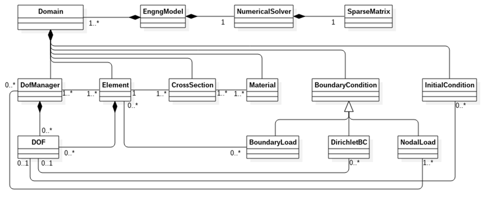

****************************************************
General Structure
****************************************************

General structure is shown in Fig (fig-generalstructure_).
The key class is `EngineeringModel` representing the problem
under consideration. It can contain one or more domains (abstractions
for computational mesh) represented by the `Domain` class.
Generally
speaking, it contains the domain description, or if the program runs in
parallel, then it contains the description of the domain associated
with a particular processor or thread of execution. `Domain` class 
contains and manages lists of degree of freedom managers, elements, boundary
conditions, cross sections, and material models - these describe the geometry
of the problem, its constitutive properties, and applied boundary
conditions. Services for accessing each of these objects are
provided.  
`Domain` class & object provides services for reading input
files and instantiating corresponding components accordingly. 

   OOFEM Top level structure

The `EngngModel` class is an abstraction for the problem under
consideration. It represents the type of analysis to be performed.
Base class declares and implements the basic general services for assembling
characteristic components and services for starting the solution step and
its termination. Derived classes know the form of governing
equation and the physical meaning of  particular components. 
They are responsible for forming the governing equation for each solution
step,  usually by summing contributions from particular elements and
nodes. The underlying discrete problem is solved by suitable instance of `NumericalMethod` class, that can take advantage of efficient sparse store for characteristic matrices, represented here by `SparseMtrx` class.
This part is described in detail in `Problem representation - Engineering model`_.

Class `Element`, is an abstraction of a finite element. Element manages its DofManagers (nodes), and has its cros section and material models defined by `CrossSection` and `Material` class instances.
Element manages its Integration rules composed of individual integration points and can also have its internal DOFs.

`DOF` class is an abstraction for a single degree of freedom (DOF). It maintains
its physical meaning and associated equation number. `DOF` is
the attribute of `DofManager` class, which manages the collection
of DOFs. A typical derived class is class `Node`, representing a node in a finite element mesh.

`BoundaryCondition` and `InitialCondition` classes are abstractions of boundary and
initial conditions. They are attributes of `Domain` class and are associated
with one or more DOFs. The abstract class `Load`, derived from parent `BoundaryCondition` 
class, is an abstraction for load. It is an attribute of Domain
and can be associated with several dof managers or elements, according to
the type of loading it represents. The class declares the basic services provided by
all derived classes. Derived classes declare specific load type dependent
services and implement all necessary services.

