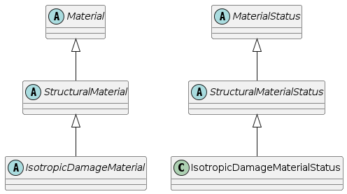

Material models
=================

The base class for all material models is the `Material` class,
derived from the `FEMComponent` parent. It declares analysis independent
part of the material interface. The analysis specific part of
the interface should be introduced by derived classes, which are supposed to represent the base
classes for specific problem. The typical example is
`StructuralMaterial` class which declares the services of material model
necessary for the structural analysis.
The generic services declared or implemented at top `Material` level include

- Material status related services. The material model has to be able to
  create instance of corresponding material status, where the history
  variables are stored. This is done by invoking `CreateStatus`.
  The status corresponding to a given integration point can be requested
  using the `giveStatus` service. 
- Services for integration point update and initialization. There are
  generally two sets of 
  history variables kept in corresponding material statuses for each
  integration point. One set is referring to previous equilibrated
  state, the second one to the actual state during the solution (more precisely to 
  the achieved local-equilibrium state), which may not
  correspond to the global equilibrium state. The methods are provided to update
  the actual state as equilibrated (`updateYourself` service) and for 
  initialization of actual state to previous equilibrium
  (`initTempStatus`). The implementation of these services
  simply extract the corresponding status of a given integration point and
  calls the corresponding service of material status. 
- Services for testing the material model capabilities
  (`testMaterialExtension`, `hasMaterialModeCapability`,
  and `hasNonLinearBehaviour` services).
- Services for requesting internal variables and properties.

Analysis specific material model classes
----------------------------------------

The direct derived classes of the `Material` class, such as `StructuralMaterial` are supposed
to declare the analysis specific
part of the material model interface, which is required (and assumed)
by the corresponding
element class (`StructuralElement`) and cross section class
(`StructuralCrossSection`).

To store all necessary history variables of the material model, so called
status concept is adopted. The material status can be thought as 
container of all necessary history variables. Usually two kinds of
these variables are stored. The temporary ones refer to the actual
state of an integration point, but do not necessary correspond to
the global equilibrium. These are changing during global equilibrium search
iteration. The non-temporary variables are related to the 
previously converged state. 
For each material model, the corresponding twin status has to be defined,
and the unique instance for each integration point has to be created
and associated with it. The integration point provides the services for
accessing corresponding status. 
All material statuses, related to particular material models, have
to be derived from the base `MaterialStatus` class. This class
declares the basic status interface. The two most important services
are: 

- `initTempStatus` intended to initialize the temporary
  internal variables according to variables related to previously reached
  equilibrium state,
- `updateYourself` designed to update the 
  equilibrium-like history variables according to temporary variables,
  when the new global equilibrium has been reached. The derived classes
  should also define methods for accessing the corresponding history
  variables.

Structural Material class - Example
-----------------------------------

The structural (or mechanical) constitutive model should generally
support several so-called material models, corresponding to various
modeling assumptions (plane-stress, plane-strain, or 1D-behavior,
for example). The concept of multiple material modes is generally
supported by `Material` class, which provides the services for testing
the model capabilities. It is generally assumed, that results obtained 
from constitutive model services are formed according to 
material mode. This mode is attribute of each integration point, 
which is compulsory parameter of all material  services. For
computational convenience, the so-called full and reduced formats of 
stress/strains vectors are introduced, corresponding to material
modes.
The full format includes all components, even if they are zero due to stress/strain mode nature.
In the reduced format, only generally nonzero components are stored.
(Full format should be used only if absolutely necessary, to avoid
wasting of space. For example, it is used 
by output routines to print results in general form). Methods for converting vectors between 
full and reduced format are provided. If possible, all computations 
should be performed in reduced space.

.. important::
    The convention used to construct reduced strain/stress vectors is as follows:
    If in a particular mode a particular stress component is zero, the corresponding strain is not computed
    and not stored in reduced vector, and in full vector there is zero value on corresponding position.
    On the other hand, if zero strain component is imposed, then this condition must be taken into 
    account in geometrical relations (at element level), and corresponding components are included
    in stress/strain reduced vectors.

Generally, the following major tasks are declared by
`StructuralMaterial` or inherited from `Material` class:

- Computing the real stress vector (tensor) at an integration point for
  a given strain increment and updating its temporary state corresponding to
  the local equilibrium, but not necessarily to the global equilibrium (see
  `giveRealStressVector`). The parameters include the total strain
  vector and the corresponding integration point. 
  The total strain is defined as strain computed directly from the
  displacement field at a given time.
  The stress independent parts (temperature, eigen strains) should be
  subtracted and  the corresponding load-history variables
  (stored in the corresponding status) can be used. The temporary
  history variables in the status should be updated according to the newly reached state.
  The temporary history variables are moved into equilibrium history
  variables just after the global structure
  equilibrium has been reached by the iteration process.
- Updating the integration point state (final state), when the global equilibrium
  has been reached. 
- Returning material stiffness and/or flexibility matrices for
  a given material mode. The general methods computing the response for
  the specific material mode are provided, based on converting 3D stiffness
  or compliance matrix to that corresponding to the specific material mode.
  But, if it is possible to compute stiffness or
  compliance matrix directly for the specific mode, then these general methods should be
  overloaded.
- Storing/restoring integration point state to/from a stream.
- Requesting internal variables, their types and properties
  (`giveIPValue`, `giveIPValueSize`,
  `giveIPValueType`, and `giveIntVarCompFullIndx` services).
- Returning material properties.

Structural material services should not be called directly by
elements. Instead, the elements should 
pass their requests to the corresponding cross section model, that performs all necessary integration over 
its volume and invokes corresponding material model services.

The `StructuralMaterial` class comes with definition of
associated material status - `StructuralMaterialStatus`.
This is only an abstract class. For every instance of
`StructuralMaterial` class 
there should be a twin statu class, which defines and maintains all necessary state variables.
The `StructuralMaterialStatus` only introduces attributes common to all structural analysis material models - the
strain and stress vectors (referring both to temporary state, corresponding to
the local
equilibrium and non-temporary ones, corresponding to the global equilibrium). The corresponding services
for accessing, setting, initializing, and updating these attributes are provided.

Isotropic Damage Model - Example
--------------------------------
In this section, the implementation of ann isotropic damage model will be
described. To cover the various models based on isotropic damage concept,
a base class `IsotropicDamageMaterial` is defined first,
declaring the necessary services and providing the implementation of
them, which are general. The derived classes then only  implement a particular
damage-evolution law.

The isotropic damage models are based on the simplifying assumption
that the stiffness degradation is isotropic, i.e., stiffness moduli
corresponding to different directions decrease proportionally and
independently of direction of loading. Consequently, the damaged
stiffness matrix is expressed as

.. math::
  {D} = (1-\omega){D}_e,

where :math:`{D}_e` is elastic stiffness matrix of the undamaged
material and :math:`\omega` is the damage parameter. Initially, :math:`\omega` is
set to zero, representing the virgin undamaged material, and the response is
linear-elastic. As the material undergoes the deformation, the
initiation and propagation of microdefects decreases the stiffness,
which is represented by the growth of the damage parameter  :math:`\omega`.
For  :math:`\omega=1`, the stiffness completely disappears.

In the present context, the :math:`D` matrix represents the secant
stiffness that relates the total strain to the total stress

.. math::
  {\sigma}={D}{\varepsilon} = (1-\omega){D}_e{\varepsilon}.

Similarly to the theory of plasticity, a loading function $f is
introduced. In the damage theory, it is natural to work in the strain
space and therefore the loading function is depending on the strain
and on an additional parameter :math:`\kappa`, describing the evolution of
the damage. Physically, :math:`\kappa` is a scalar measure of the
largest strain level ever reached. The loading function usually has
the form

.. math::
  f({\varepsilon}, \kappa) = \tilde\varepsilon({\varepsilon}) - \kappa,

where :math:`\tilde\varepsilon` is the equivalent strain, i.e., the scalar
measure of the strain level.
Damage can grow only if current state reaches the boundary of elastic
domain (:math:`f=0`). This is expressed by the following loading/unloading
conditions

.. math::
  f \le 0,\;\;\dot\kappa \ge0,\;\;\dot\kappa f = 0.
 
It remains to link the variable :math:`\kappa` to the damage parameter
:math:`\omega`. As both :math:`\kappa` and :math:`\omega` grow monotonically, it is
convenient to postulate an explicit evolution law

.. math::
  \omega = g(\kappa).

The important advantage of this explicit formulation is that the
stress corresponding to the given strain can be evaluated directly,
without the need to solve the nonlinear system of equations.
For the given strain, the corresponding stress is computed simply by
evaluating the current equivalent strain, updating the maximum
previously reached equivalent strain value :math:`\kappa`  and the damage
parameter and reducing the effective stress according to :math:`{\sigma}
= (1-\omega){D}_e {\varepsilon}`.

This general framework for computing stresses and
stiffness matrix is  common for all material models of this type.
Therefore, it is natural to introduce
the base class for all isotropic-based damage models which provides the general
implementation for the stress and stiffness matrix evaluation
algorithms. The particular models then only provide their equivalent
strain and damage evolution law definitions.
The base class only declares the virtual services for computing equivalent
strain and corresponding damage. The implementation of common services
uses these virtual functions, but they are only declared at
`IsotropicDamageMaterial` class level and have to be
implemented by the derived classes.

Together with the material model, the corresponding status has to be
defined, containing all necessary history variables.
For the isotropic-based damage models, the only history variable is 
the value of the largest strain level ever reached (:math:`\kappa`).
In addition, the corresponding damage level $\omega$ will be stored.
This is not necessary because damage can be always computed from
corresponding :math:`\kappa`.
The `IsotropicDamageMaterialStatus` class is derived from 
`StructuralMaterialStatus` class. The base class represents the
base material status class for all structural statuses. At
`StructuralMaterialStatus` level, the attributes common to all
structural analysis material models - the strain and
stress vectors (both the temporary and non-temporary) are introduced. The
corresponding services for accessing, setting, initializing, and
updating these attributes are provided.
Therefore, only the :math:`\kappa` and :math:`\omega` parameters are introduced
(both the temporary and non-temporary). The corresponding services for
manipulating these attributes are added and services for context
initialization, update, and store/restore operations are overloaded, to
handle the history parameters properly.

..  //www.plantuml.com/plantuml/png/SoWkIImgAStDuN9CAYufIamkKKZEIImkLl1DB4ajoap440ykAIfDBYajIip1fSApEB-aAByWCzabCJSnFHMk39SDmIM99QN51En1gCDj2K8D5uolO5EZgulDpGWX5AMu7Ozg0rWnRZVYai1j1qAlGsfU2Z0-0000

The declaration of the `IsotropicDamageMaterialStatus` class follows:

.. code-block:: cpp
   :linenos:

    class IsotropicDamageMaterialStatus : public StructuralMaterialStatus {
    protected:
    /// scalar measure of the largest strain level ever reached in material
    double kappa;
    /// non-equilibrated scalar measure of the largest strain level
    double tempKappa;
    /// damage level of material
    double damage;
    /// non-equilibrated damage level of material
    double tempDamage;

    public: 
    /// Constructor
    IsotropicDamageMaterialStatus (int n, Domain*d, GaussPoint* g) ;
    /// Destructor
    ~IsotropicDamageMaterialStatus ();

    /// Prints the receiver state to stream
    void   printOutputAt (FILE *file, TimeStep* tStep) ;

    /// Returns the last equilibrated scalar measure 
    /// of the largest strain level
    double giveKappa () {return kappa;}
    /// Returns the temp. scalar measure of the 
    /// largest strain level
    double giveTempKappa () {return tempKappa;}
    /// Sets the temp scalar measure of the largest 
    /// strain level to given value
    void   setTempKappa (double newKappa) { tempKappa = newKappa;}
    /// Returns the last equilibrated damage level
    double giveDamage () {return damage;}
    /// Returns the temp. damage level
    double giveTempDamage () {return tempDamage;}
    /// Sets the temp damage level to given value
    void   setTempDamage (double newDamage) { tempDamage = newDamage;}

    // definition
    char*                 giveClassName (char* s) const
        { return strcpy(s,"IsotropicDamageMaterialModelStatus") ;}
    classType             giveClassID () const 
        { return IsotropicDamageMaterialStatusClass; }

    /**
        Initializes the temporary internal variables, 
        describing the current state according to 
        previously reached equilibrium internal variables.
    */
    virtual void initTempStatus ();
    /**
        Update equilibrium history variables 
        according to temp-variables.
        Invoked, after new equilibrium state has been reached.
    */
    virtual void updateYourself(TimeStep*); 

    // saves current context(state) into stream
    /**
        Stores context of receiver into given stream. 
        Only non-temp internal history variables are stored.
        @param stream stream where to write data
        @param obj pointer to integration point, which invokes this method
        @return nonzero if o.k.
    */
    contextIOResultType    saveContext (FILE* stream, void *obj = NULL);
    /**
        Restores context of receiver from given stream. 
        @param stream stream where to read data
        @param obj pointer to integration point, which invokes this method
        @return nonzero if o.k.
    */
    contextIOResultType    restoreContext(FILE* stream, void *obj = NULL);
    };  

The base `IsotropicDamageMaterial` class is derived
from the `StructuralMaterial` class. 
The generic methods defined by `StructuralMaterial` require only to implement two fundamental services:

- `give3dMaterialStiffnessMatrix` for evaluating the material stiffness matrix in full, 3D mode,
- `giveRealStressVector_3d` for computing the real stress vector in 3D mode.

The remaining material modes are derived from these two basic services.
However, the derived classes can reimplement (overload) these services, when desired. In our case, it is possible to obtain reduced stress and stiffness in more efficient way, than done in generic way on `StructuralMaterial` level and which requires matrix inversion. 
Therefore, the services for reduced modes are overloaded.

.. code-block:: cpp
   :linenos:

    class IsotropicDamageMaterial : public StructuralMaterial
    {
    protected:
        /// Coefficient of thermal dilatation.
        double tempDillatCoeff = 0.;

        /// Maximum limit on omega. The purpose is elimination of a too compliant material which may cause convergence problems. Set to something like 0.99 if needed.
        double maxOmega = 0.999999;

        /// Indicator of the type of permanent strain formulation (0 = standard damage with no permanent strain)
        int permStrain = 0;

        /// Reference to bulk (undamaged) material
        LinearElasticMaterial *linearElasticMaterial = nullptr;
        /**
        * Variable controlling type of loading/unloading law, default set to idm_strainLevel
        * defines the two two possibilities:
        * - idm_strainLevelCR the unloading takes place, when strain level is smaller than the largest level ever reached;
        * - idm_damageLevelCR the unloading takes place, when damage level is smaller than the largest damage ever  reached;
        */
        enum loaUnloCriterium { idm_strainLevelCR, idm_damageLevelCR } llcriteria = idm_strainLevelCR;

    public:
        /// Constructor
        IsotropicDamageMaterial(int n, Domain *d);
        /// Destructor
        virtual ~IsotropicDamageMaterial();

        bool hasMaterialModeCapability(MaterialMode mode) const override;
        const char *giveClassName() const override { return "IsotropicDamageMaterial"; }

        /// Returns reference to undamaged (bulk) material
        LinearElasticMaterial *giveLinearElasticMaterial() { return linearElasticMaterial; }

        FloatMatrixF<6,6> give3dMaterialStiffnessMatrix(MatResponseMode mode, GaussPoint *gp, TimeStep *tStep) const override;

        void giveRealStressVector(FloatArray &answer, GaussPoint *gp,
                                const FloatArray &reducedStrain, TimeStep *tStep) override;

        FloatArrayF<6> giveRealStressVector_3d(const FloatArrayF<6> &strain, GaussPoint *gp, TimeStep *tStep) const override
        {
            FloatArray answer;
            const_cast<IsotropicDamageMaterial*>(this)->giveRealStressVector(answer, gp, strain, tStep);
            return answer;
        }
        FloatArrayF<4> giveRealStressVector_PlaneStrain( const FloatArrayF<4> &strain, GaussPoint *gp, TimeStep *tStep) const override
        {
            FloatArray answer;
            const_cast<IsotropicDamageMaterial*>(this)->giveRealStressVector(answer, gp, strain, tStep);
            return answer;
        }
        FloatArray giveRealStressVector_StressControl(const FloatArray &strain, const IntArray &strainControl, GaussPoint *gp, TimeStep *tStep) const override
        {
            FloatArray answer;
            const_cast<IsotropicDamageMaterial*>(this)->giveRealStressVector(answer, gp, strain, tStep);
            return answer;
        }
        FloatArrayF<3> giveRealStressVector_PlaneStress(const FloatArrayF<3> &strain, GaussPoint *gp, TimeStep *tStep) const override
        {
            FloatArray answer;
            const_cast<IsotropicDamageMaterial*>(this)->giveRealStressVector(answer, gp, strain, tStep);
            return answer;
        }
        FloatArrayF<1> giveRealStressVector_1d(const FloatArrayF<1> &strain, GaussPoint *gp, TimeStep *tStep) const override
        {
            FloatArray answer;
            const_cast<IsotropicDamageMaterial*>(this)->giveRealStressVector(answer, gp, strain, tStep);
            return answer;
        }

        int giveIPValue(FloatArray &answer, GaussPoint *gp, InternalStateType type, TimeStep *tStep) override;

        FloatArrayF<6> giveThermalDilatationVector(GaussPoint *gp, TimeStep *tStep) const override;
        virtual double evaluatePermanentStrain(double kappa, double omega) const { return 0.; }

        /**
        * Returns the value of material property 'aProperty'. Property must be identified
        * by unique int id. Integration point also passed to allow for materials with spatially
        * varying properties
        * @param aProperty ID of property requested.
        * @param gp Integration point,
        * @return Property value.
        */
        double give(int aProperty, GaussPoint *gp) const override;
        /**
        * Computes the equivalent strain measure from given strain vector (full form).
        * @param[out] kappa Return parameter, containing the corresponding equivalent strain.
        * @param strain Total strain vector in full form.
        * @param gp Integration point.
        * @param tStep Time step.
        */
        virtual double computeEquivalentStrain(const FloatArray &strain, GaussPoint *gp, TimeStep *tStep) const = 0;
        /**Computes derivative of the equivalent strain with regards to strain
        * @param[out] answer Contains the resulting derivative.
        * @param strain Strain vector.
        * @param gp Integration point.
        * @param tStep Time step.
        */
        virtual void computeEta(FloatArray &answer, const FloatArray &strain, GaussPoint *gp, TimeStep *tStep) const { OOFEM_ERROR("not implemented"); }
        /**
        * Computes the value of damage parameter omega, based on given value of equivalent strain.
        * @param[out] omega Contains result.
        * @param kappa Equivalent strain measure.
        * @param strain Total strain in full form.
        * @param gp Integration point.
        */
        virtual double computeDamageParam(double kappa, const FloatArray &strain, GaussPoint *gp) const = 0;

        void initializeFrom(InputRecord &ir) override;
        void giveInputRecord(DynamicInputRecord &input) override;

        MaterialStatus *CreateStatus(GaussPoint *gp) const override { return new IsotropicDamageMaterialStatus(gp); }

        FloatMatrixF<1,1> give1dStressStiffMtrx(MatResponseMode mmode, GaussPoint *gp,
                                                TimeStep *tStep) const override;
    
        void saveContext(DataStream &stream, ContextMode mode) override;
        void restoreContext(DataStream &stream, ContextMode mode) override;
        
    protected:
        /**
        * Abstract service allowing to perform some initialization, when damage first appear.
        * @param kappa Scalar measure of strain level.
        * @param totalStrainVector Current total strain vector.
        * @param gp Integration point.
        */
        virtual void initDamaged(double kappa, FloatArray &totalStrainVector, GaussPoint *gp) const { }

        /**
        * Returns the value of derivative of damage function
        * wrt damage-driving variable kappa corresponding
        * to a given value of the  kappa, depending on
        * the type of selected damage law.
        * @param kappa Equivalent strain measure.
        * @param gp Integration point.
        */
        virtual double damageFunctionPrime(double kappa, GaussPoint *gp) const {
            OOFEM_ERROR("not implemented");
            return 0;
        }

        FloatMatrixF<3,3> givePlaneStressStiffMtrx(MatResponseMode mmode, GaussPoint *gp,TimeStep *tStep) const override;
        FloatMatrixF<4,4> givePlaneStrainStiffMtrx(MatResponseMode mmode, GaussPoint *gp, TimeStep *tStep) const override;

    };

Finally we present the implementation of the selected methods of `IsotropicDamageMaterial` class.
Let us start with the implementation of the `give3dMaterialStiffnessMatrix` method, which computes the 3D material stiffness, respecting the previous loading history described by state variable:

.. code-block:: cpp
   :linenos:

    FloatMatrixF<6,6>
    IsotropicDamageMaterial :: give3dMaterialStiffnessMatrix(MatResponseMode mode,
                                                            GaussPoint *gp,
                                                            TimeStep *tStep) const
    //
    // computes full constitutive matrix for case of gp stress-strain state.
    //
    {
        auto status = static_cast< IsotropicDamageMaterialStatus * >( this->giveStatus(gp) );
        double tempDamage;
        if ( mode == ElasticStiffness ) {
            tempDamage = 0.0;
        } else {
            tempDamage = status->giveTempDamage();
            tempDamage = min(tempDamage, maxOmega);
        }

        auto d = this->linearElasticMaterial->give3dMaterialStiffnessMatrix(mode, gp, tStep);
        return d * (1.0 - tempDamage);
        //TODO - correction for tangent mode
    }

The `giveRealStressesVector` method computes the real stress
respecting the previous loading history (described by state variables) and the given strain vector. It computes
a new locally consistent (equilibrated) state, which is stored in temporary
variables of the corresponding status (attribute of the integration point). 

.. code-block:: cpp
   :linenos:

    void
    IsotropicDamageMaterial :: giveRealStressVector(FloatArray &answer, GaussPoint *gp,
                                                    const FloatArray &totalStrain,
                                                    TimeStep *tStep)
    //
    // returns real stress vector in 3d stress space of receiver according to
    // previous level of stress and current
    // strain increment, the only way, how to correctly update gp records
    //
    {
        IsotropicDamageMaterialStatus *status = static_cast< IsotropicDamageMaterialStatus * >( this->giveStatus(gp) );
        LinearElasticMaterial *lmat = this->giveLinearElasticMaterial();
        FloatArray reducedTotalStrainVector;
        FloatMatrix de;
        double f, equivStrain, tempKappa = 0.0, omega = 0.0;

        this->initTempStatus(gp);

        // subtract stress-independent part
        // note: eigenStrains (temperature) are present in strains stored in gp
        // therefore it is necessary to subtract always the total eigen strain value
        this->giveStressDependentPartOfStrainVector(reducedTotalStrainVector, gp, totalStrain, tStep, VM_Total);

        // compute equivalent strain
        equivStrain = this->computeEquivalentStrain(reducedTotalStrainVector, gp, tStep);
        
        if ( llcriteria == idm_strainLevelCR ) {
            // compute value of loading function if strainLevel crit apply
            f = equivStrain - status->giveKappa();

            if ( f <= 0.0 ) {
                // damage does not grow
                tempKappa = status->giveKappa();
                omega     = status->giveDamage();
            } else {
                // damage grows
                tempKappa = equivStrain;
                this->initDamaged(tempKappa, reducedTotalStrainVector, gp);
                // evaluate damage parameter
                omega = this->computeDamageParam(tempKappa, reducedTotalStrainVector, gp);
            }
        } else if ( llcriteria == idm_damageLevelCR ) {
            // evaluate damage parameter first
            tempKappa = equivStrain;
            this->initDamaged(tempKappa, reducedTotalStrainVector, gp);
            omega = this->computeDamageParam(tempKappa, reducedTotalStrainVector, gp);
            if ( omega < status->giveDamage() ) {
                // unloading takes place
                omega = status->giveDamage();
            }
        } else {
            OOFEM_ERROR("unsupported loading/unloading criterion");
        }

        // get material stiffness from bulk material
        lmat->giveStiffnessMatrix(de, SecantStiffness, gp, tStep);

        // damage deactivation in compression for 1D model
        if ( ( reducedTotalStrainVector.giveSize() > 1 ) || ( reducedTotalStrainVector.at(1) > 0. ) ) {
            //emj
            de.times(1.0 - omega);
        }

        answer.beProductOf(de, reducedTotalStrainVector);

        // update gp status
        status->letTempStrainVectorBe(totalStrain);
        status->letTempStressVectorBe(answer);
        status->setTempKappa(tempKappa);
        status->setTempDamage(omega);
    }

The above general class provides the general framework. The derived
classes have to implement only services
`computeEquivalentStrain` and `computeDamageParam`,
which are only related to particular material model under consideration.
For full reference, please refer to the src/sm/Materials/isotropicdamagematerial.h and src/sm/Materials/isotropicdamagematerial.C files.

For example of simple Isotropic Damage Model, please refer to the src/sm/Materials/ConcreteMaterials/idm1.h and src/sm/Materials/ConcreteMaterials/idm1.C files.

