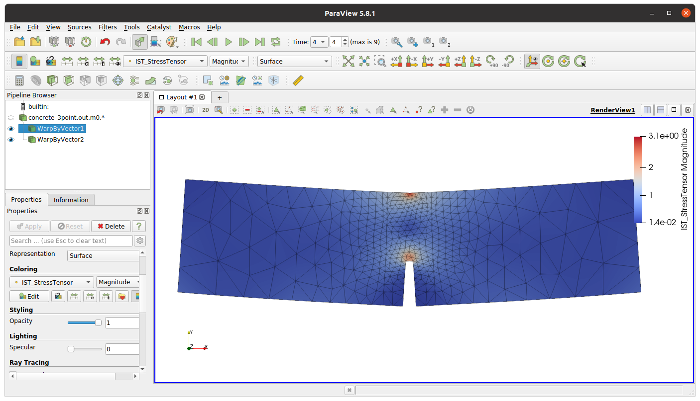

.. _postprocessing:

Postprocessing
==============

By default, oofem produces output in the form of readable text file, called output file.
At the same time, oofem can produce output in other formats, that are more suitable for postprocessing in third-party tools. This is done by configuring one or more export modules in the input file.
In this short tutorial, we will cover vtk postprocessing. 

Configuring vtk export
----------------------
VTK is a widely used format for storing simulation results. The vtk files can be opened in many visualization tools. 
The export of results in vtk format can be done using ``vtkxml`` export module. 
The number of export modules is defined in analysis record using ``nmodules`` keyword. The records for export modules should immediately follow analysis record.
The detailed syntax of ``vtkxml`` record is described in oofem input manual. 
As an example, consider an example of 3-point bending test input file (located in `tests/benchmark/sm/concrete_3point.in <https://github.com/oofem/oofem/blob/master/tests/benchmark/sm/concrete_3point.in>`_) which we modify to add vtk export:
 
::

    concrete_3point.out
    Test: 3-point bending, triangular elements, 1 loaded point
    StaticStructural nsteps 4 solverType "calm" stepLength 0.025  rtolf 1e-4 Psi 0.0 MaxIter 200 reqIterations 80 HPC 2 1 2 stiffmode 1 nmodules 1
    vtkxml tstep_all dofman_all element_all primvars 1 1 vars 2 1 4         
    ...

The export has been requested for all solution steps ``tstep_all``, all dof managers (nodes) ``dofman_all`` and all elements ``element_all``. The primary variables exported consists of displacement vector: ``primvars 1 1``, where ``primvars`` is the keyword for primary variable export, what follows is an array of primary variables IDs (defined in `src/core/unknowntype.h <https://github.com/oofem/oofem/blob/master/src/core/unknowntype.h>`_), first number determines the array size.
The export of secondary (internal) variables consists of strain and stress tensors (``vars 2 1 4``, where internal variable codes are defined in `src/core/internalstatetype.h <https://github.com/oofem/oofem/blob/master/src/core/internalstatetype.h>`_).

After running the modified, extended  input the solver will produce for each solution step ``vtu`` file.

Postprocessing in paraview
--------------------------
In this example, we will use Paraview (Open-source, multi-platform data analysis and visualization application, `www.paraview.org <https://www.paraview.org/>`_).
After installation of this tool, simply launch paraview and open one or all vtu files produced.

