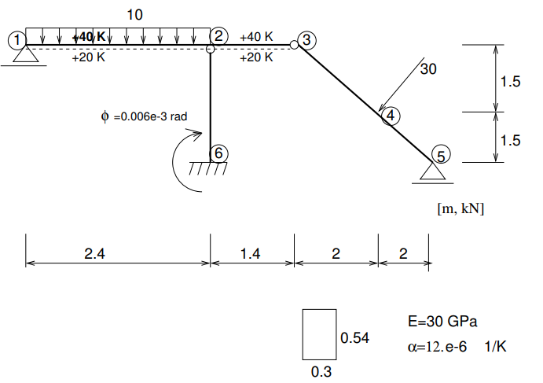

.. _understanding_input:

Understanding input file
=========================

The OOFEM input file fully describes the problem under consideration. Input file is a text file with specific structure, outlined below and fully documented in `OOFEM Input manual <http://www.oofem.org/resources/doc/oofemInput/html/oofemInput.html>`_.

The input file can be prepared manually by any text editor or generated by special purpose code, preprocessor or converter.

Input file consists of several sections

* Ordering of sections is compulsory
* Each section can consist of one or more records ( corresponding to lines)
* Each record starts with a keyword followed by compulsory or optional parameters
* Input file can contain comments (lines beginning with ‘#’ character)
* Long Input records (lines) can be splitted using continuation character at the end of each line ‘\\’
* Content is not case sensitive

An Example
^^^^^^^^^^
Consider the linear elastic analysis of beam structure, as illustrated on 

The full input file `beam2d_1.in <https://github.com/oofem/oofem/blob/master/tests/sm/beam2d_1.in>`_ listing is following:

.. code-block::

    beam2d_1.out
    Simple Beam Structure - linear analysis
    #only momentum influence to the displacements is taken into account
    #beamShearCoeff is artificially enlarged.
    StaticStructural nsteps 3 nmodules 0
    domain 2dBeam
    OutputManager tstep_all dofman_all element_all
    ndofman 6 nelem 5 ncrosssect 1 nmat 1 nbc 6 nic 0 nltf 3 nset 7
    node 1 coords 3 0. 0. 0.
    node 2 coords 3 2.4 0. 0.
    node 3 coords 3 3.8 0. 0.
    node 4 coords 3 5.8 0. 1.5
    node 5 coords 3 7.8 0. 3.0
    node 6 coords 3 2.4 0. 3.0
    Beam2d 1 nodes 2 1 2
    Beam2d 2 nodes 2 2 3 DofsToCondense 1 6
    Beam2d 3 nodes 2 3 4 DofsToCondense 1 3
    Beam2d 4 nodes 2 4 5
    Beam2d 5 nodes 2 6 2 DofsToCondense 1 6
    SimpleCS 1 area 1.e8 Iy 0.0039366 beamShearCoeff 1.e18 thick 0.54 material 1 set 1
    IsoLE 1 d 1. E 30.e6 n 0.2 tAlpha 1.2e-5
    BoundaryCondition 1 loadTimeFunction 1 dofs 1 3 values 1 0.0 set 4
    BoundaryCondition 2 loadTimeFunction 1 dofs 1 5 values 1 0.0 set 5
    BoundaryCondition 3 loadTimeFunction 2 dofs 3 1 3 5 values 3 0.0 0.0 -0.006e-3 set 6
    ConstantEdgeLoad 4 loadTimeFunction 1 Components 3 0.0 10.0 0.0 loadType 3 set 3
    NodalLoad 5 loadTimeFunction 1 dofs 3 1 3 5 Components 3 -18.0 24.0 0.0 set 2
    StructTemperatureLoad 6 loadTimeFunction 3 Components 2 30.0 -20.0 set 7
    PeakFunction 1 t 1.0 f(t) 1.
    PeakFunction 2 t 2.0 f(t) 1.
    PeakFunction 3 t 3.0 f(t) 1.
    Set 1 elementranges {(1 5)}
    Set 2 nodes 1 4
    Set 3 elementedges 2 1 1
    Set 4 nodes 2 1 5
    Set 5 nodes 1 3
    Set 6 nodes 1 6
    Set 7 elements 2 1 2    

The details explained
"""""""""""""""""""""

The input file starts with ``output file record`` represented by a line containing the path to output file

.. code-block::

    beam2d_1.out

Next, the ``job description record`` follows represented by a line with free text describing the problem

.. code-block::

    Simple Beam Structure - linear analysis

Next record, called ``analysis record`` determines the problem to be solved. In our case we solve linear elastic problem represented by ``StaticStructural`` keyword. The analysis keyword has compulsory parameter ``nsteps`` determining in this case the number of time steps representing load cases in our example.

.. code-block::

    StaticStructural nsteps 3

Next, the domain type is described. At present version, the domain type is no longer relevant, but it is maintained for compatibility reasons. So we declare our domain type as 2dbeam. Note that oofem allows to combine different element types with different degrees of freedom per node. 

.. code-block::

        domain 2dBeam

The next record determines what the default output should contain. In our case, we require output for all time steps and all elements

.. code-block::

        OutputManager tstep_all dofman_all element_all

The ``components size record`` determines the number of nodes, elements, cross-section and material models and other components describing the discretization and problem.

.. code-block::

    ndofman 6 nelem 5 ncrosssect 1 nmat 1 nbc 6 nic 0 nltf 3 nset 7

Here the ``ndofman`` determines the number of dof managers (nodes), the ``nelem`` determines the number of elements, ``ncrosssect`` determines the number of cross section models (oofem decouples the geometrical model of cross section from matterial model). The number of material models used is determined by ``nmat`` keyword. Number of boundary and initial conditions is determined by ``nbc`` and ``nic`` keywords, respectively. Number of functions, determining time variation or activity of certain component, is described using ``nltf`` keyword. Finally, number of sets, which are used to group entities into groups to assign for example material or boundary conditions, is determined by ``nset`` keyword.

Next, the nodal records follow. The number of nodes has been determined in the ``components size record`` and so the input contains in our case 6 records (lines) for individual nodes. The nodal records start with ``node`` keyword followed by its label, which is later used to refer to specific node. Labels should be unique integer numbers. A number of optional or compulsory parameters follows. Compulsory parameters determine the nodal coordinates, for example.

.. code-block::

    node 1 coords 3 0. 0. 0.
    node 2 coords 3 2.4 0. 0.
    node 3 coords 3 3.8 0. 0.
    node 4 coords 3 5.8 0. 1.5
    node 5 coords 3 7.8 0. 3.0
    node 6 coords 3 2.4 0. 3.0

Next, the element records follow. The number of elements has been specified in ``components size record`` and so the input contains in our case 5 records (lines) for individual elements. The element type is determined by element keyword at the beginning of each record. In our case, we use ``beam2d`` element type (Available element types are documented in `OOFEM Element manual <http://www.oofem.org/resources/doc/elementlibmanual/html/elementlibmanual.html>`_.

The element type keyword is followed by a compuslory parameters (determining the element nodes, for example) and optional parameters (in our case determining which element degrees of freedom to condense out to represent hinge type of connection).

.. code-block::

    Beam2d 1 nodes 2 1 2
    Beam2d 2 nodes 2 2 3 DofsToCondense 1 6
    Beam2d 3 nodes 2 3 4 DofsToCondense 1 3
    Beam2d 4 nodes 2 4 5
    Beam2d 5 nodes 2 6 2 DofsToCondense 1 6

After element records, the records describing cross-section models follow. In our example, the cross section consists of single cross section (same dimensions) made of single material, so we use integral cross section model, represented by ``SimpleCS`` keyword, which is followed by cross section model label (unique integer number) followed by parameters describing cross section dimensions and associated material model (``material`` keyword). The cross section model is associated to all elements in given set (``set keyword).

.. code-block::

    SimpleCS 1 area 1.e8 Iy 0.0039366 beamShearCoeff 1.e18 thick 0.54 material 1 set 1

Similar to cross section models, we follow with material models. IN our example we have a single linear isotropic material model, represented by ``isole`` keyword. This keyword is followed by a material model label (unique integer number) followed by a number of parameters determining material model parameters.

.. code-block::

    IsoLE 1 d 1. E 30.e6 n 0.2 tAlpha 1.2e-5

Next, we proceed with boundary conditions. In our example, we have 6 boundary conditions in total. The first one is Dirichlet type boundary condition, corresponding to fixed vertical displacement (prescribed is one nodal DOF corresponding to vertical displacement in z-direction: ``dofs 1 3``) enforced at nodes 1 and 5 (specified using ``set 4``)

.. code-block::

    BoundaryCondition 1 loadTimeFunction 1 dofs 1 3 values 1 0.0 set 4

The second boundary condition is fixed rotation in node 3. Yes, in node 3 we need to fix rotation, as both connected elements (2 and 3) have independent, condensed rotations, so that there is no rotation stiffness in node 3 and thus the nodal rotation has to be fixed.

.. code-block::

    BoundaryCondition 2 loadTimeFunction 1 dofs 1 5 values 1 0.0 set 5

The third boundary condition is used to enforce the clamped displacements and prescribed rotation at node 6.

.. code-block::

    BoundaryCondition 3 loadTimeFunction 2 dofs 3 1 3 5 values 3 0.0 0.0 -0.006e-3 set 6        

The remaining three boundary condition represent applied constant edge load on element 1, concentrated loading at node 4, and temperature loading on element 1.

.. code-block::
    
    ConstantEdgeLoad 4 loadTimeFunction 1 Components 3 0.0 10.0 0.0 loadType 3 set 3
    NodalLoad 5 loadTimeFunction 1 dofs 3 1 3 5 Components 3 -18.0 24.0 0.0 set 2
    StructTemperatureLoad 6 loadTimeFunction 3 Components 2 30.0 -20.0 set 7

What follows is ``function section`` defining the functions. They are attributes of several components (boundary conditions, for example) and define, how the things evolve in time or space. In this example, the functions are only functions of time, determining the time evolution of boundary condition values.
The example is divided into three load cases, in the first load case only force loading is taken into account, so all force loads (labels 4 and 5) have the first function associated (using ``loadTimeFunction`` keyword) which is nonzero in the first time increment and zero otherwise. Similarly, the prescribed rotation is applied exclusively in second loading step and temperature loading in the third.

The input is finally concluded with defining the sets, that are used to define group of nodes, elements, element edges, etc, on which the boundary conditions or cross sections are applied.

.. code-block::

    Set 1 elementranges {(1 5)}
    Set 2 nodes 1 4
    Set 3 elementedges 2 1 1
    Set 4 nodes 2 1 5
    Set 5 nodes 1 3
    Set 6 nodes 1 6
    Set 7 elements 2 1 2

For more information about the input file structure, please follow `OOFEM Input manual <http://www.oofem.org/resources/doc/oofemInput/html/oofemInput.html>`_.